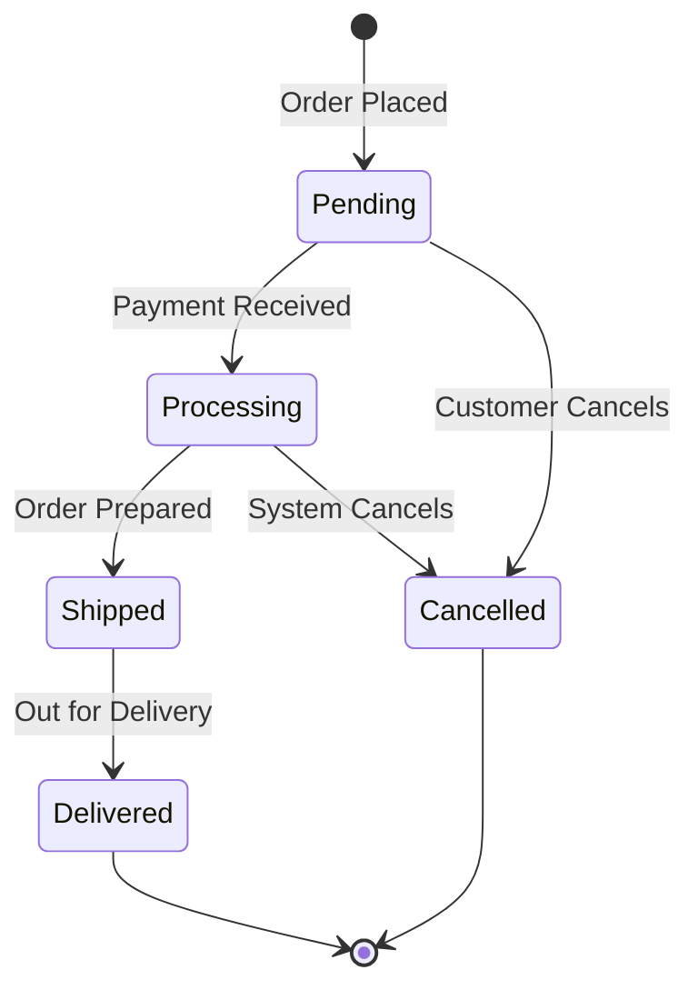
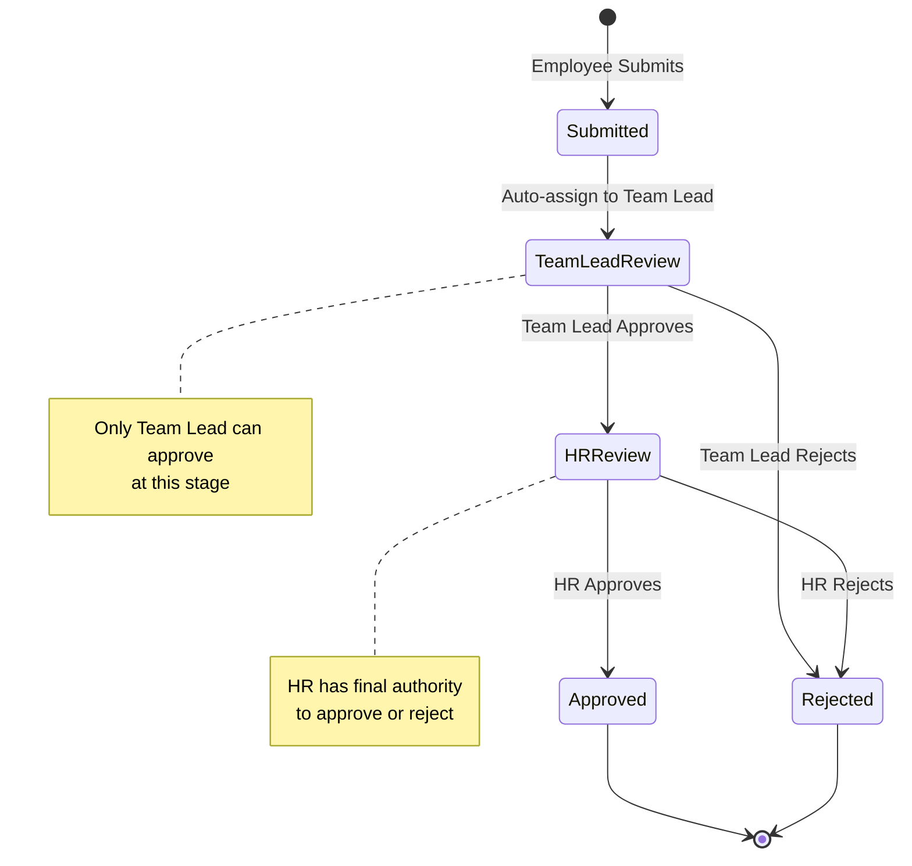
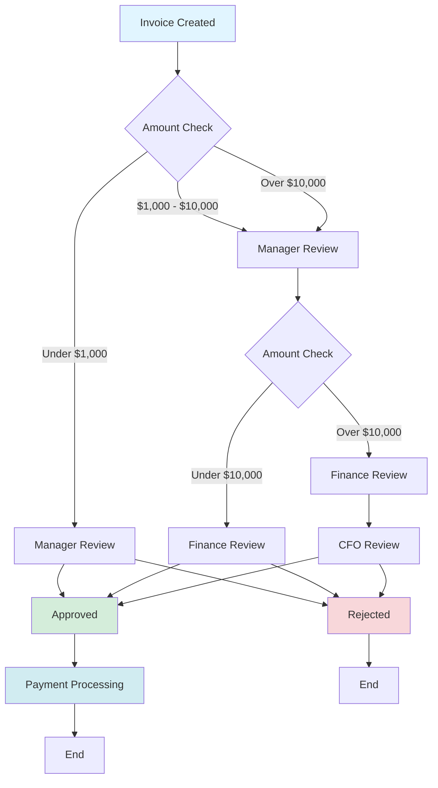
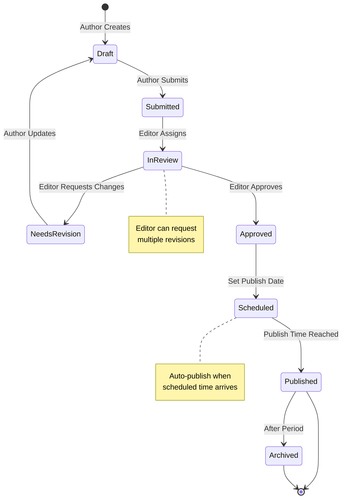
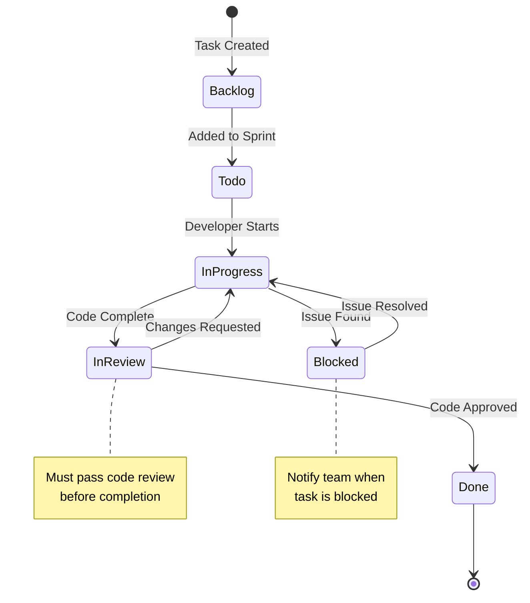
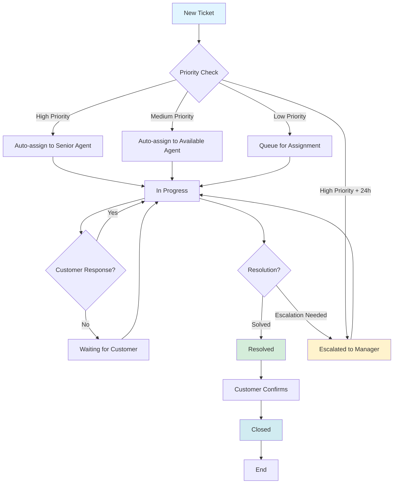
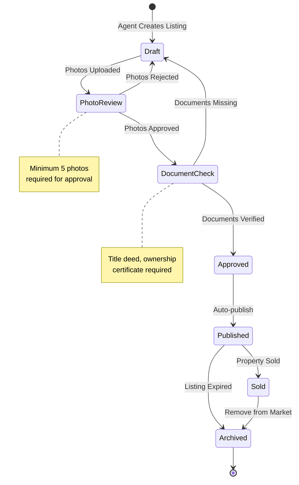
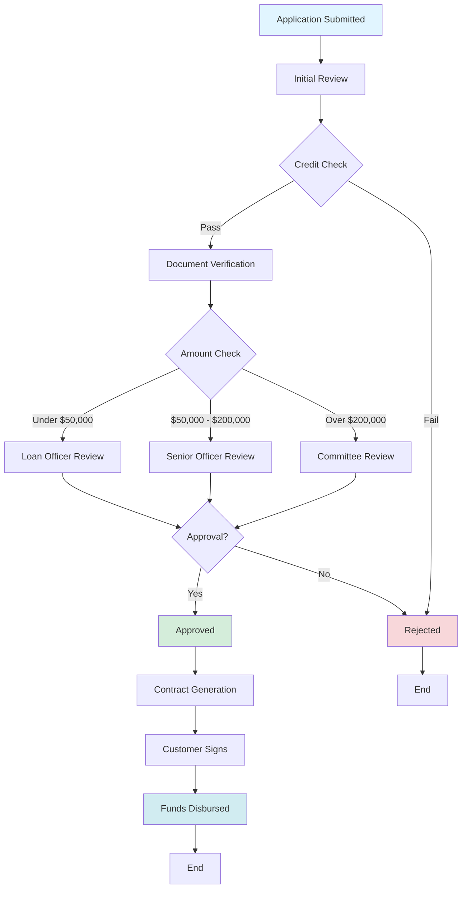

import Link from "@docusaurus/Link";

# Laravel Flow Showcase

Discover real-world examples and use cases of Laravel Flow in action. See how different businesses leverage workflow management to streamline their processes and automate complex business logic.

## E-Commerce Order Processing

  

    

      <svg className="w-6 h-6 text-white" fill="none" stroke="currentColor" viewBox="0 0 24 24">
        <path strokeLinecap="round" strokeLinejoin="round" strokeWidth={2} d="M16 11V7a4 4 0 00-8 0v4M5 9h14l1 12H4L5 9z" />
      </svg>
    

    

      <h3 className="text-2xl font-bold text-gray-900 dark:text-white">Order Management System</h3>
      
Complete order lifecycle from placement to delivery

    

  

  

    

      <h4 className="text-lg font-semibold text-gray-900 dark:text-white mb-4">Order Workflow</h4>
    

  

  

    

      

        <strong className="text-gray-900 dark:text-white">Use Case:</strong> Automatically handle order status updates, send email notifications to customers at each stage, update inventory when orders are processed, trigger shipping label generation when orders are shipped, and send delivery confirmations.
      

    

  

## HR Leave Request Management

  

    

      <svg className="w-6 h-6 text-white" fill="none" stroke="currentColor" viewBox="0 0 24 24">
        <path strokeLinecap="round" strokeLinejoin="round" strokeWidth={2} d="M17 20h5v-2a3 3 0 00-5.356-1.857M17 20H7m10 0v-2c0-.656-.126-1.283-.356-1.857M7 20H2v-2a3 3 0 015.356-1.857M7 20v-2c0-.656.126-1.283.356-1.857m0 0a5.002 5.002 0 019.288 0M15 7a3 3 0 11-6 0 3 3 0 016 0zm6 3a2 2 0 11-4 0 2 2 0 014 0zM7 10a2 2 0 11-4 0 2 2 0 014 0z" />
      </svg>
    

    

      <h3 className="text-2xl font-bold text-gray-900 dark:text-white">Employee Leave Request</h3>
      
Multi-level approval workflow for leave requests

    

  

  

    

      <h4 className="text-lg font-semibold text-gray-900 dark:text-white mb-4">Approval Workflow</h4>
    

  

  

    

      

        <strong className="text-gray-900 dark:text-white">Use Case:</strong> Implement hierarchical approval workflows where leave requests must pass through multiple levels (Team Lead → HR → Final Decision) with role-based access control. Automatically notify relevant parties at each stage and update employee calendars upon approval.
      

    

  

## Financial Invoice Approval

  

    

      <svg className="w-6 h-6 text-white" fill="none" stroke="currentColor" viewBox="0 0 24 24">
        <path strokeLinecap="round" strokeLinejoin="round" strokeWidth={2} d="M9 12h6m-6 4h6m2 5H7a2 2 0 01-2-2V5a2 2 0 012-2h5.586a1 1 0 01.707.293l5.414 5.414a1 1 0 01.293.707V19a2 2 0 01-2 2z" />
      </svg>
    

    

      <h3 className="text-2xl font-bold text-gray-900 dark:text-white">Invoice Approval Process</h3>
      
Multi-stage financial approval with amount-based routing

    

  

  

    

      <h4 className="text-lg font-semibold text-gray-900 dark:text-white mb-4">Dynamic Approval Routing</h4>
    

  

  

    

      

        <strong className="text-gray-900 dark:text-white">Use Case:</strong> Implement dynamic approval routing based on invoice amount. Small invoices ($1,000) go directly to manager for approval. Medium invoices ($1,000-$10,000) require manager and finance approval. Large invoices ($10,000+) must pass through manager, finance, and CFO. Automatically create journal entries and notify vendors upon approval.
      

    

  

## Content Publishing Workflow

  

    

      <svg className="w-6 h-6 text-white" fill="none" stroke="currentColor" viewBox="0 0 24 24">
        <path strokeLinecap="round" strokeLinejoin="round" strokeWidth={2} d="M11 5H6a2 2 0 00-2 2v11a2 2 0 002 2h11a2 2 0 002-2v-5m-1.414-9.414a2 2 0 112.828 2.828L11.828 15H9v-2.828l8.586-8.586z" />
      </svg>
    

    

      <h3 className="text-2xl font-bold text-gray-900 dark:text-white">Blog Post Publishing</h3>
      
Editorial workflow from draft to publication

    

  

  

    

      <h4 className="text-lg font-semibold text-gray-900 dark:text-white mb-4">Editorial Workflow</h4>
    

  

  

    

      

        <strong className="text-gray-900 dark:text-white">Use Case:</strong> Manage content lifecycle with editorial review, revision cycles, and scheduled publishing. Automatically optimize SEO, generate sitemaps, share on social media, and notify subscribers when content is published. Archive old content after a specified period.
      

    

  

## Project Management Task Flow

  

    

      <svg className="w-6 h-6 text-white" fill="none" stroke="currentColor" viewBox="0 0 24 24">
        <path strokeLinecap="round" strokeLinejoin="round" strokeWidth={2} d="M9 5H7a2 2 0 00-2 2v12a2 2 0 002 2h10a2 2 0 002-2V7a2 2 0 00-2-2h-2M9 5a2 2 0 002 2h2a2 2 0 002-2M9 5a2 2 0 012-2h2a2 2 0 012 2m-6 9l2 2 4-4" />
      </svg>
    

    

      <h3 className="text-2xl font-bold text-gray-900 dark:text-white">Task Lifecycle</h3>
      
Agile task management with sprint integration

    

  

  

    

      <h4 className="text-lg font-semibold text-gray-900 dark:text-white mb-4">Task Workflow</h4>
    

  

  

    

      

        <strong className="text-gray-900 dark:text-white">Use Case:</strong> Manage agile development workflows with sprint tracking. Automatically update sprint velocity when tasks are completed, calculate project progress, notify team members when tasks are blocked, and generate burndown charts based on task state transitions.
      

    

  

## Customer Support Ticket System

  

    

      <svg className="w-6 h-6 text-white" fill="none" stroke="currentColor" viewBox="0 0 24 24">
        <path strokeLinecap="round" strokeLinejoin="round" strokeWidth={2} d="M8 10h.01M12 10h.01M16 10h.01M9 16H5a2 2 0 01-2-2V6a2 2 0 012-2h14a2 2 0 012 2v8a2 2 0 01-2 2h-5l-5 5v-5z" />
      </svg>
    

    

      <h3 className="text-2xl font-bold text-gray-900 dark:text-white">Support Ticket Workflow</h3>
      
Priority-based ticket routing and escalation

    

  

  

    

      <h4 className="text-lg font-semibold text-gray-900 dark:text-white mb-4">Ticket Lifecycle</h4>
    

  

  

    

      

        <strong className="text-gray-900 dark:text-white">Use Case:</strong> Automatically route tickets to appropriate agents based on category and priority. High-priority tickets are auto-escalated after 24 hours if not resolved. Maintain customer communication throughout the resolution process and automatically close tickets after customer confirmation.
      

    

  

## Real Estate Property Listing

  

    

      <svg className="w-6 h-6 text-white" fill="none" stroke="currentColor" viewBox="0 0 24 24">
        <path strokeLinecap="round" strokeLinejoin="round" strokeWidth={2} d="M3 12l2-2m0 0l7-7 7 7M5 10v10a1 1 0 001 1h3m10-11l2 2m-2-2v10a1 1 0 01-1 1h-3m-6 0a1 1 0 001-1v-4a1 1 0 011-1h2a1 1 0 011 1v4a1 1 0 001 1m-6 0h6" />
      </svg>
    

    

      <h3 className="text-2xl font-bold text-gray-900 dark:text-white">Property Listing Approval</h3>
      
Multi-stage property verification and publishing

    

  

  

    

      <h4 className="text-lg font-semibold text-gray-900 dark:text-white mb-4">Verification Workflow</h4>
    

  

  

    

      

        <strong className="text-gray-900 dark:text-white">Use Case:</strong> Manage property listings through verification stages. Ensure all required documents and photos are present before approval. Automatically publish to multiple listing platforms when approved, index in search engines, and notify interested buyers. Archive listings when sold or expired.
      

    

  

## Loan Application Processing

  

    

      <svg className="w-6 h-6 text-white" fill="none" stroke="currentColor" viewBox="0 0 24 24">
        <path strokeLinecap="round" strokeLinejoin="round" strokeWidth={2} d="M12 8c-1.657 0-3 .895-3 2s1.343 2 3 2 3 .895 3 2-1.343 2-3 2m0-8c1.11 0 2.08.402 2.599 1M12 8V7m0 1v8m0 0v1m0-1c-1.11 0-2.08-.402-2.599-1M21 12a9 9 0 11-18 0 9 9 0 0118 0z" />
      </svg>
    

    

      <h3 className="text-2xl font-bold text-gray-900 dark:text-white">Loan Application Workflow</h3>
      
Comprehensive loan processing with credit checks

    

  

  

    

      <h4 className="text-lg font-semibold text-gray-900 dark:text-white mb-4">Application Process</h4>
    

  

  

    

      

        <strong className="text-gray-900 dark:text-white">Use Case:</strong> Process loan applications through multiple verification stages including credit checks, document verification, and approval routing based on loan amount. Automatically generate contracts, send for e-signature, and disburse funds upon completion.
      

    

  

## Get Started

Ready to implement workflows in your application? Check out our comprehensive documentation:

  <Link
    to="/packages/laravel-flow/docs/general"
    className="group bg-gradient-to-br from-white to-gray-50 dark:from-gray-800 dark:to-gray-900 rounded-xl p-6 border border-gray-200 dark:border-gray-700 hover:border-primary dark:hover:border-primary hover:shadow-lg transition-all duration-300"
  >
    
📖

    <h3 className="text-lg font-bold text-gray-900 dark:text-white group-hover:text-primary dark:group-hover:text-primary-light transition-colors mb-2">
      General Guide
    </h3>
    

      Learn the fundamentals of workflow management
    

  </Link>

  <Link
    to="/packages/laravel-flow/docs/flow"
    className="group bg-gradient-to-br from-white to-gray-50 dark:from-gray-800 dark:to-gray-900 rounded-xl p-6 border border-gray-200 dark:border-gray-700 hover:border-primary dark:hover:border-primary hover:shadow-lg transition-all duration-300"
  >
    
⚙️

    <h3 className="text-lg font-bold text-gray-900 dark:text-white group-hover:text-primary dark:group-hover:text-primary-light transition-colors mb-2">
      Flow Setup
    </h3>
    

      Set up your first workflow driver
    

  </Link>

  <Link
    to="/packages/laravel-flow/intro"
    className="group bg-gradient-to-br from-white to-gray-50 dark:from-gray-800 dark:to-gray-900 rounded-xl p-6 border border-gray-200 dark:border-gray-700 hover:border-primary dark:hover:border-primary hover:shadow-lg transition-all duration-300"
  >
    
🚀

    <h3 className="text-lg font-bold text-gray-900 dark:text-white group-hover:text-primary dark:group-hover:text-primary-light transition-colors mb-2">
      Installation
    </h3>
    

      Get started with Laravel Flow
    

  </Link>

