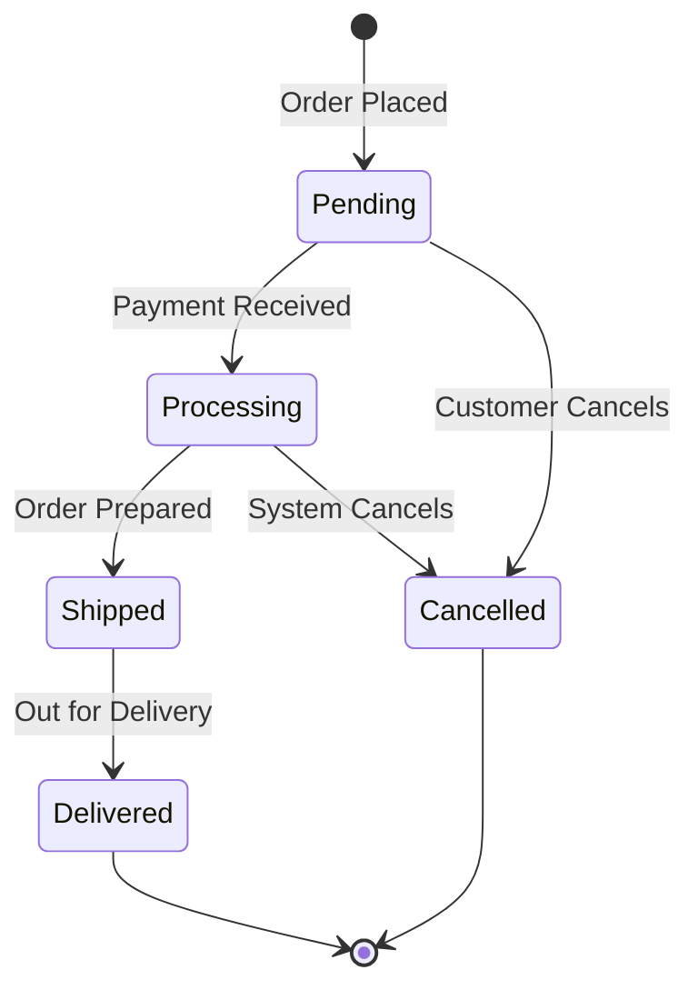
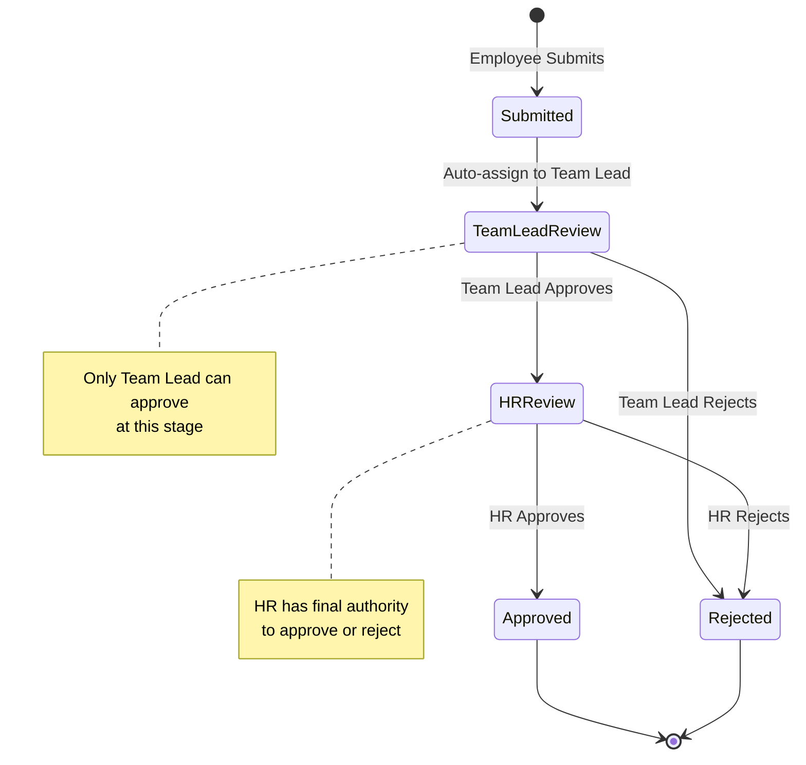
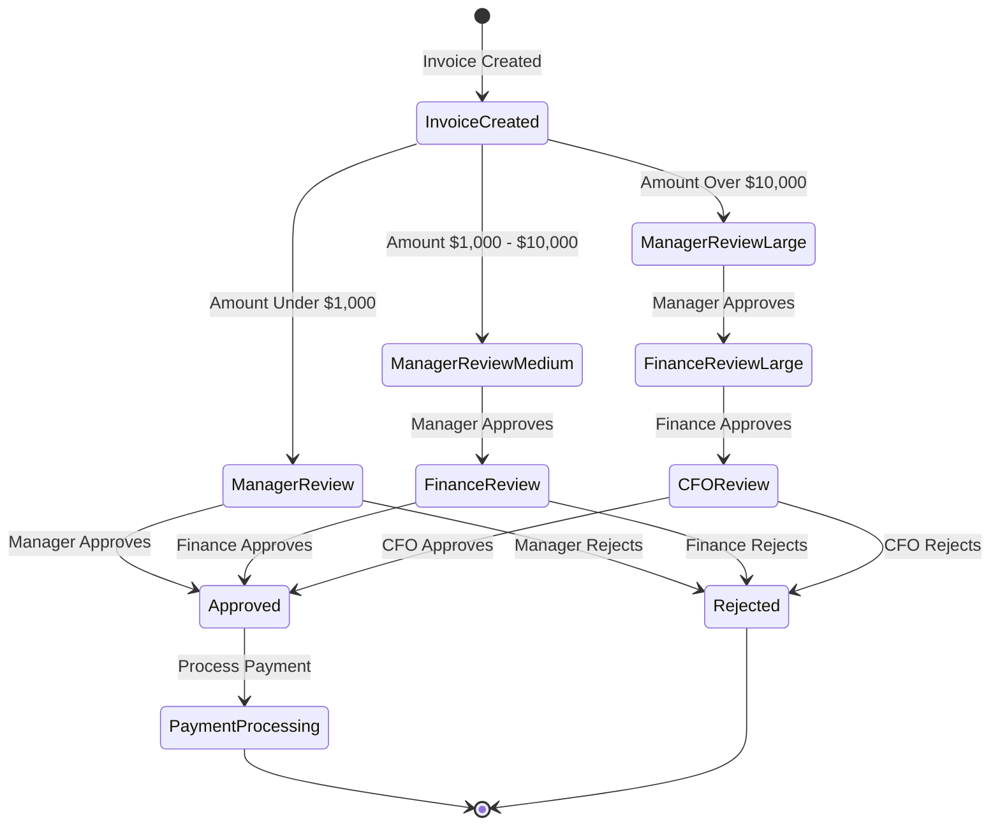
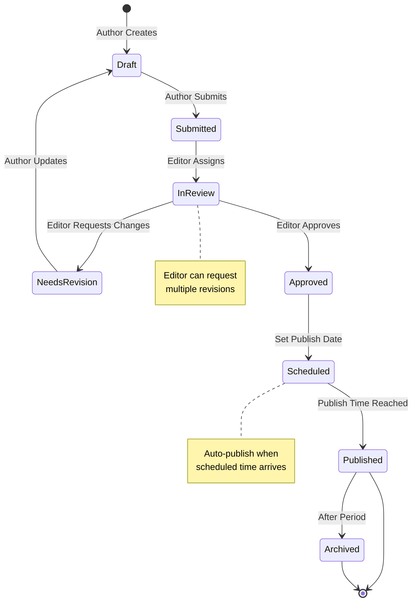
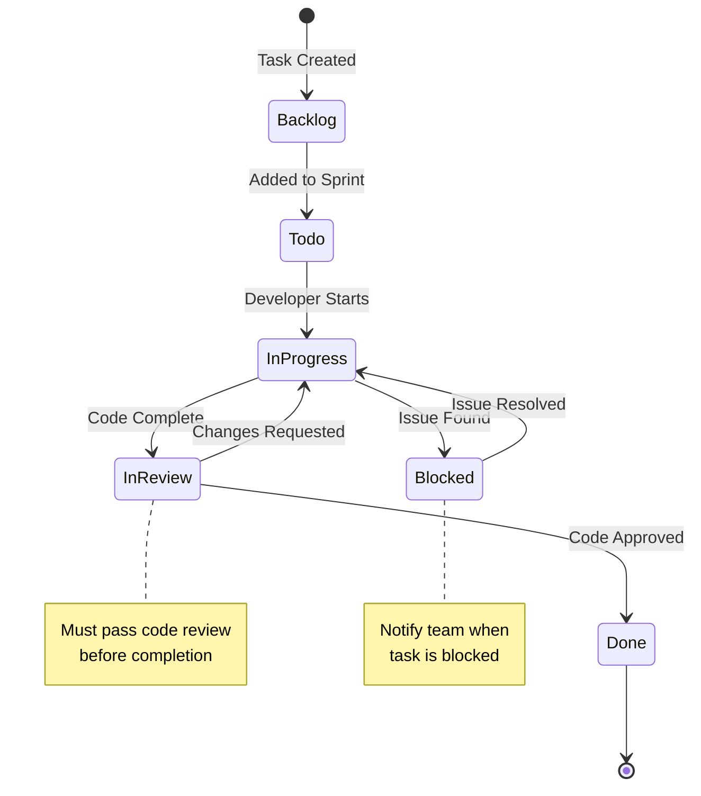
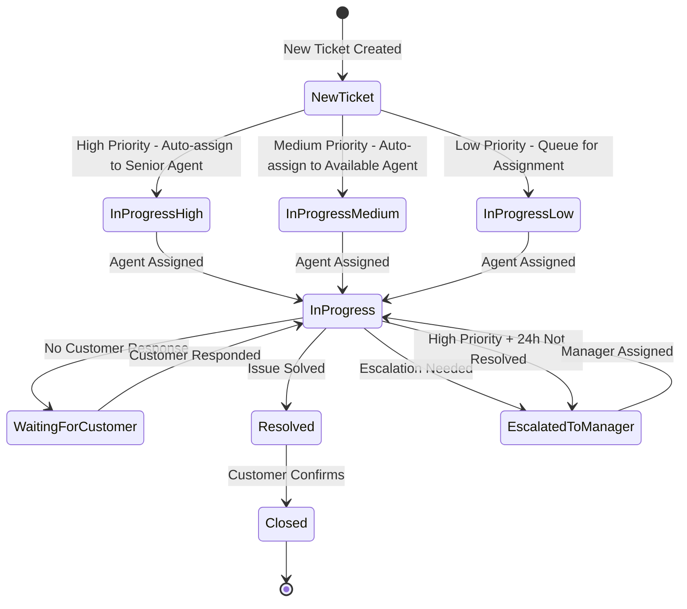
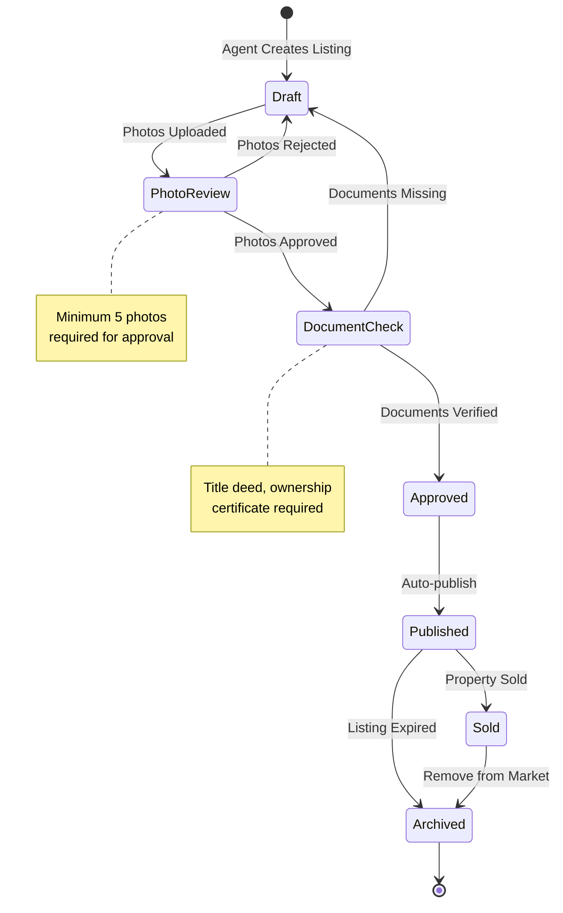
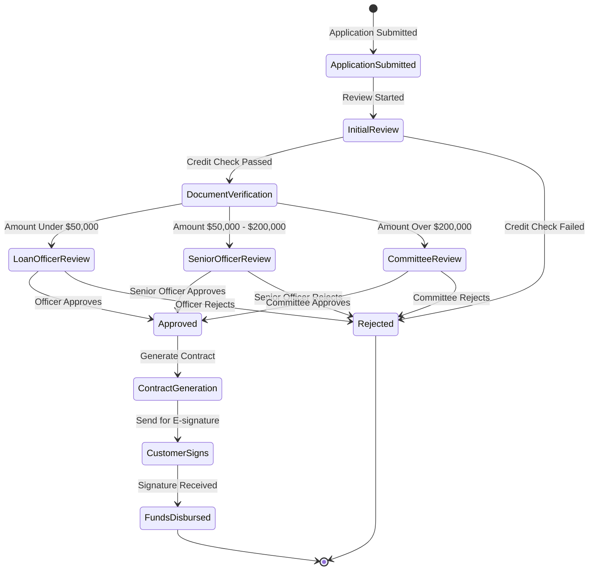

import Link from "@docusaurus/Link";

# Laravel Flow Showcase

Discover real-world examples and use cases of Laravel Flow in action. See how different businesses leverage workflow management to streamline their processes and automate complex business logic.

## Understanding Workflow Components

Each workflow in Laravel Flow consists of:

- **States**: Represent different stages in your process. Each state has a type:

  - **Start** (Initial): Entry point of the workflow
  - **Middle** (Intermediate): States between start and end
  - **End** (Terminal): Final states where the workflow completes

- **Transitions**: Define how work moves between states. Each transition can execute three types of tasks:
  - **Restriction Tasks**: Check if the transition is allowed (permissions, conditions)
  - **Validation Tasks**: Validate data before transitioning
  - **Action Tasks**: Execute actions when transitioning (notifications, updates, etc.)

## E-Commerce Order Processing

  

  

  

    

      

        <svg className="w-8 h-8 text-white" fill="none" stroke="currentColor" viewBox="0 0 24 24">
          <path strokeLinecap="round" strokeLinejoin="round" strokeWidth={2} d="M16 11V7a4 4 0 00-8 0v4M5 9h14l1 12H4L5 9z" />
        </svg>
      

      

        <h3 className="text-2xl font-bold text-gray-900 dark:text-white group-hover:text-primary dark:group-hover:text-primary-light transition-colors">Order Management System</h3>
        
Complete order lifecycle from placement to delivery

      

    

    

      

        <h4 className="text-base sm:text-lg font-semibold text-gray-900 dark:text-white mb-3 sm:mb-4">Overview</h4>
        

          The E-Commerce Order Processing workflow manages the complete lifecycle of customer orders from the moment they are placed until final delivery or cancellation. This workflow ensures seamless coordination between payment processing, inventory management, fulfillment, and shipping operations. Each state transition triggers automated tasks that keep customers informed and maintain accurate inventory levels.
        

        

        

          <h5 className="text-sm sm:text-base font-semibold text-gray-900 dark:text-white mb-2">Key Features</h5>
          <ul className="text-xs sm:text-sm text-gray-700 dark:text-gray-300 space-y-1 list-disc list-inside">
            <li>Automatic inventory updates</li>
            <li>Real-time customer notifications</li>
            <li>Payment verification and processing</li>
            <li>Shipping label generation</li>
            <li>Order cancellation handling</li>
          </ul>
        

        

          <h5 className="text-sm sm:text-base font-semibold text-gray-900 dark:text-white mb-2">Business Benefits</h5>
          <ul className="text-xs sm:text-sm text-gray-700 dark:text-gray-300 space-y-1 list-disc list-inside">
            <li>Reduced manual processing time</li>
            <li>Improved order accuracy</li>
            <li>Better customer experience</li>
            <li>Automated inventory management</li>
            <li>Real-time order tracking</li>
          </ul>
        

      

    

    

      <h4 className="text-base sm:text-lg font-semibold text-gray-900 dark:text-white mb-3 sm:mb-4">Order Workflow</h4>
      

        Start: Pending
        Middle: Processing, Shipped
        End: Delivered, Cancelled
      

      

        Orders begin in the <strong>Pending</strong> state when a customer places an order. They move to <strong>Processing</strong> once payment is confirmed, then to <strong>Shipped</strong> when items are prepared and dispatched. The workflow can end in either <strong>Delivered</strong> (successful completion) or <strong>Cancelled</strong> (if cancelled at any stage).
      

      

    

  

  

    

      <h4 className="text-base sm:text-lg font-semibold text-gray-900 dark:text-white mb-3 sm:mb-4">
        Transition Tasks
      </h4>
      

        Each transition can have <strong>multiple tasks</strong> of each type
        (Restriction, Validation, Action), or <strong>none at all</strong>.
        Tasks are executed in order:{" "}
        <strong>Restriction → Validation → Action</strong>.
      

      

        <table className="min-w-full divide-y divide-gray-200 dark:divide-gray-700">
          <thead className="bg-gray-50 dark:bg-gray-800">
            <tr>
              <th className="px-2 sm:px-3 md:px-4 py-2 sm:py-3 text-left text-xs font-medium text-gray-500 dark:text-gray-400 uppercase tracking-wider">
                Transition
              </th>
              <th className="px-2 sm:px-3 md:px-4 py-2 sm:py-3 text-left text-xs font-medium text-gray-500 dark:text-gray-400 uppercase tracking-wider">
                Restriction Tasks{" "}
                
                  (Optional)
                
              </th>
              <th className="px-2 sm:px-3 md:px-4 py-2 sm:py-3 text-left text-xs font-medium text-gray-500 dark:text-gray-400 uppercase tracking-wider">
                Validation Tasks{" "}
                
                  (Optional)
                
              </th>
              <th className="px-2 sm:px-3 md:px-4 py-2 sm:py-3 text-left text-xs font-medium text-gray-500 dark:text-gray-400 uppercase tracking-wider">
                Action Tasks{" "}
                
                  (Optional)
                
              </th>
            </tr>
          </thead>
          <tbody className="bg-white dark:bg-gray-900 divide-y divide-gray-200 dark:divide-gray-700">
            <tr>
              <td className="px-2 sm:px-3 md:px-4 py-2 sm:py-3 text-xs sm:text-sm text-gray-900 dark:text-gray-100 font-medium align-top">
                Pending → Processing
              </td>
              <td className="px-2 sm:px-3 md:px-4 py-2 sm:py-3 text-xs sm:text-sm text-gray-600 dark:text-gray-400 align-top">
                <ul className="list-disc list-inside space-y-1 text-xs sm:text-sm text-gray-700 dark:text-gray-300 ml-2 sm:ml-4">
                  <li>Check payment status is completed</li>
                  <li>Verify order is not already cancelled</li>
                </ul>
              </td>
              <td className="px-2 sm:px-3 md:px-4 py-2 sm:py-3 text-xs sm:text-sm text-gray-600 dark:text-gray-400 align-top">
                <ul className="list-disc list-inside space-y-1 text-xs sm:text-sm text-gray-700 dark:text-gray-300 ml-2 sm:ml-4">
                  <li>Validate payment amount matches order total</li>
                  <li>Validate payment method is valid</li>
                </ul>
              </td>
              <td className="px-2 sm:px-3 md:px-4 py-2 sm:py-3 text-xs sm:text-sm text-gray-600 dark:text-gray-400 align-top">
                <ul className="list-disc list-inside space-y-1 text-xs sm:text-sm text-gray-700 dark:text-gray-300 ml-2 sm:ml-4">
                  <li>Update inventory levels</li>
                  <li>Send order confirmation email to customer</li>
                  <li>Create fulfillment task</li>
                </ul>
              </td>
            </tr>
            <tr className="bg-gray-50 dark:bg-gray-800">
              <td className="px-2 sm:px-3 md:px-4 py-2 sm:py-3 text-xs sm:text-sm text-gray-900 dark:text-gray-100 font-medium align-top">
                Processing → Shipped
              </td>
              <td className="px-2 sm:px-3 md:px-4 py-2 sm:py-3 text-xs sm:text-sm text-gray-600 dark:text-gray-400 align-top">
                <ul className="list-disc list-inside space-y-1 text-xs sm:text-sm text-gray-700 dark:text-gray-300 ml-2 sm:ml-4">
                  <li>Check all items are available in inventory</li>
                  <li>Verify shipping address is complete</li>
                </ul>
              </td>
              <td className="px-2 sm:px-3 md:px-4 py-2 sm:py-3 text-xs sm:text-sm text-gray-600 dark:text-gray-400 align-top">
                <ul className="list-disc list-inside space-y-1 text-xs sm:text-sm text-gray-700 dark:text-gray-300 ml-2 sm:ml-4">
                  <li>Validate shipping address format</li>
                  <li>Validate shipping method is available</li>
                </ul>
              </td>
              <td className="px-2 sm:px-3 md:px-4 py-2 sm:py-3 text-xs sm:text-sm text-gray-600 dark:text-gray-400 align-top">
                <ul className="list-disc list-inside space-y-1 text-xs sm:text-sm text-gray-700 dark:text-gray-300 ml-2 sm:ml-4">
                  <li>Generate shipping label</li>
                  <li>Send tracking number email to customer</li>
                  <li>Update order tracking status</li>
                </ul>
              </td>
            </tr>
            <tr>
              <td className="px-2 sm:px-3 md:px-4 py-2 sm:py-3 text-xs sm:text-sm text-gray-900 dark:text-gray-100 font-medium align-top">
                Shipped → Delivered
              </td>
              <td className="px-2 sm:px-3 md:px-4 py-2 sm:py-3 text-xs sm:text-sm text-gray-600 dark:text-gray-400 align-top">
                <ul className="list-disc list-inside space-y-1 text-xs sm:text-sm text-gray-700 dark:text-gray-300 ml-2 sm:ml-4">
                  <li>Verify delivery confirmation received</li>
                </ul>
              </td>
              <td className="px-2 sm:px-3 md:px-4 py-2 sm:py-3 text-xs sm:text-sm text-gray-600 dark:text-gray-400 align-top">
                <ul className="list-disc list-inside space-y-1 text-xs sm:text-sm text-gray-700 dark:text-gray-300 ml-2 sm:ml-4">
                  <li>Validate delivery signature</li>
                  <li>Validate delivery date</li>
                </ul>
              </td>
              <td className="px-2 sm:px-3 md:px-4 py-2 sm:py-3 text-xs sm:text-sm text-gray-600 dark:text-gray-400 align-top">
                <ul className="list-disc list-inside space-y-1 text-xs sm:text-sm text-gray-700 dark:text-gray-300 ml-2 sm:ml-4">
                  <li>Send delivery confirmation email</li>
                  <li>Update order status to delivered</li>
                  <li>Request customer feedback</li>
                </ul>
              </td>
            </tr>
            <tr className="bg-gray-50 dark:bg-gray-800">
              <td className="px-2 sm:px-3 md:px-4 py-2 sm:py-3 text-xs sm:text-sm text-gray-900 dark:text-gray-100 font-medium align-top">
                Pending → Cancelled
              </td>
              <td className="px-2 sm:px-3 md:px-4 py-2 sm:py-3 text-xs sm:text-sm text-gray-600 dark:text-gray-400 align-top">
                <ul className="list-disc list-inside space-y-1 text-xs sm:text-sm text-gray-700 dark:text-gray-300 ml-2 sm:ml-4">
                  <li>Check cancellation policy allows cancellation</li>
                  <li>Verify cancellation time window</li>
                </ul>
              </td>
              <td className="px-2 sm:px-3 md:px-4 py-2 sm:py-3 text-xs sm:text-sm text-gray-600 dark:text-gray-400 align-top">
                <ul className="list-disc list-inside space-y-1 text-xs sm:text-sm text-gray-700 dark:text-gray-300 ml-2 sm:ml-4">
                  <li>Validate cancellation reason is provided</li>
                </ul>
              </td>
              <td className="px-2 sm:px-3 md:px-4 py-2 sm:py-3 text-xs sm:text-sm text-gray-600 dark:text-gray-400 align-top">
                <ul className="list-disc list-inside space-y-1 text-xs sm:text-sm text-gray-700 dark:text-gray-300 ml-2 sm:ml-4">
                  <li>Process refund payment</li>
                  <li>Send cancellation confirmation email</li>
                  <li>Update order status</li>
                </ul>
              </td>
            </tr>
            <tr>
              <td className="px-2 sm:px-3 md:px-4 py-2 sm:py-3 text-xs sm:text-sm text-gray-900 dark:text-gray-100 font-medium align-top">
                Processing → Cancelled
              </td>
              <td className="px-2 sm:px-3 md:px-4 py-2 sm:py-3 text-xs sm:text-sm text-gray-600 dark:text-gray-400 align-top">
                <ul className="list-disc list-inside space-y-1 text-xs sm:text-sm text-gray-700 dark:text-gray-300 ml-2 sm:ml-4">
                  <li>Check system cancellation rules</li>
                  <li>Verify cancellation is allowed at this stage</li>
                </ul>
              </td>
              <td className="px-2 sm:px-3 md:px-4 py-2 sm:py-3 text-xs sm:text-sm text-gray-600 dark:text-gray-400 align-top">
                <ul className="list-disc list-inside space-y-1 text-xs sm:text-sm text-gray-700 dark:text-gray-300 ml-2 sm:ml-4">
                  <li>Validate cancellation reason</li>
                  <li>Validate cancellation is authorized</li>
                </ul>
              </td>
              <td className="px-2 sm:px-3 md:px-4 py-2 sm:py-3 text-xs sm:text-sm text-gray-600 dark:text-gray-400 align-top">
                <ul className="list-disc list-inside space-y-1 text-xs sm:text-sm text-gray-700 dark:text-gray-300 ml-2 sm:ml-4">
                  <li>Restore items to inventory</li>
                  <li>Process refund payment</li>
                  <li>Notify customer via email</li>
                  <li>Update order status</li>
                </ul>
              </td>
            </tr>
          </tbody>
        </table>
      

    

    

      

        <strong className="text-gray-900 dark:text-white">Use Case:</strong>{" "}
        Automatically handle order status updates, send email notifications to
        customers at each stage, update inventory when orders are processed,
        trigger shipping label generation when orders are shipped, and send
        delivery confirmations.
      

      

        <h5 className="text-xs sm:text-sm font-semibold text-gray-900 dark:text-white mb-2">
          Real-World Implementation:
        </h5>
        

          This workflow is ideal for online stores, marketplaces, and e-commerce
          platforms. It ensures that every order is properly tracked, customers
          are kept informed at each stage, inventory is automatically updated,
          and shipping processes are streamlined. The cancellation paths allow
          for flexible order management while maintaining data integrity.
        

      

    

  

## HR Leave Request Management

  

  

  

    

      

        <svg className="w-8 h-8 text-white" fill="none" stroke="currentColor" viewBox="0 0 24 24">
          <path strokeLinecap="round" strokeLinejoin="round" strokeWidth={2} d="M17 20h5v-2a3 3 0 00-5.356-1.857M17 20H7m10 0v-2c0-.656-.126-1.283-.356-1.857M7 20H2v-2a3 3 0 015.356-1.857M7 20v-2c0-.656.126-1.283.356-1.857m0 0a5.002 5.002 0 019.288 0M15 7a3 3 0 11-6 0 3 3 0 016 0zm6 3a2 2 0 11-4 0 2 2 0 014 0zM7 10a2 2 0 11-4 0 2 2 0 014 0z" />
        </svg>
      

      

        <h3 className="text-2xl font-bold text-gray-900 dark:text-white group-hover:text-primary dark:group-hover:text-primary-light transition-colors">Employee Leave Request</h3>
        
Multi-level approval workflow for leave requests

      

    

    

      

        <h4 className="text-base sm:text-lg font-semibold text-gray-900 dark:text-white mb-3 sm:mb-4">Overview</h4>
        

        The HR Leave Request Management workflow implements a hierarchical approval system where employee leave requests must pass through multiple levels of authorization. This ensures proper oversight, maintains leave balance accuracy, and automatically updates employee calendars. The workflow supports role-based access control, ensuring only authorized personnel can approve or reject requests at each stage.
      

      

        

          <h5 className="font-semibold text-gray-900 dark:text-white mb-2">Key Features</h5>
          <ul className="text-sm text-gray-700 dark:text-gray-300 space-y-1 list-disc list-inside">
            <li>Hierarchical approval routing</li>
            <li>Role-based access control</li>
            <li>Automatic leave balance deduction</li>
            <li>Calendar integration</li>
            <li>Multi-level notification system</li>
          </ul>
        

        

          <h5 className="font-semibold text-gray-900 dark:text-white mb-2">Business Benefits</h5>
          <ul className="text-sm text-gray-700 dark:text-gray-300 space-y-1 list-disc list-inside">
            <li>Streamlined approval process</li>
            <li>Reduced administrative overhead</li>
            <li>Accurate leave tracking</li>
            <li>Improved compliance</li>
            <li>Better workforce planning</li>
          </ul>
        

      

    

    

      <h4 className="text-lg font-semibold text-gray-900 dark:text-white mb-4">Approval Workflow</h4>
      

        Start: Submitted
        Middle: TeamLeadReview, HRReview
        End: Approved, Rejected
      

      

        Employees submit leave requests which are automatically routed to their Team Lead for initial review. Upon Team Lead approval, requests proceed to HR for final authorization. Both Team Leads and HR can reject requests at their respective stages, with all parties notified of decisions.
      

      

    

  

  

    

      <h4 className="text-base sm:text-lg font-semibold text-gray-900 dark:text-white mb-3 sm:mb-4">
        Transition Tasks
      </h4>
      

        Each transition can have <strong>multiple tasks</strong> of each type
        (Restriction, Validation, Action), or <strong>none at all</strong>.
        Tasks are executed in order:{" "}
        <strong>Restriction → Validation → Action</strong>.
      

      

        <table className="min-w-full divide-y divide-gray-200 dark:divide-gray-700">
          <thead className="bg-gray-50 dark:bg-gray-800">
            <tr>
              <th className="px-2 sm:px-3 md:px-4 py-2 sm:py-3 text-left text-xs font-medium text-gray-500 dark:text-gray-400 uppercase tracking-wider">
                Transition
              </th>
              <th className="px-2 sm:px-3 md:px-4 py-2 sm:py-3 text-left text-xs font-medium text-gray-500 dark:text-gray-400 uppercase tracking-wider">
                Restriction Tasks{" "}
                
                  (Optional)
                
              </th>
              <th className="px-2 sm:px-3 md:px-4 py-2 sm:py-3 text-left text-xs font-medium text-gray-500 dark:text-gray-400 uppercase tracking-wider">
                Validation Tasks{" "}
                
                  (Optional)
                
              </th>
              <th className="px-2 sm:px-3 md:px-4 py-2 sm:py-3 text-left text-xs font-medium text-gray-500 dark:text-gray-400 uppercase tracking-wider">
                Action Tasks{" "}
                
                  (Optional)
                
              </th>
            </tr>
          </thead>
          <tbody className="bg-white dark:bg-gray-900 divide-y divide-gray-200 dark:divide-gray-700">
            <tr>
              <td className="px-2 sm:px-3 md:px-4 py-2 sm:py-3 text-xs sm:text-sm text-gray-900 dark:text-gray-100 font-medium align-top">
                Submitted → TeamLeadReview
              </td>
              <td className="px-2 sm:px-3 md:px-4 py-2 sm:py-3 text-xs sm:text-sm text-gray-600 dark:text-gray-400 align-top">
                <ul className="list-disc list-inside space-y-1 text-xs sm:text-sm text-gray-700 dark:text-gray-300 ml-2 sm:ml-4">
                  <li>Auto-assign based on employee's team</li>
                  <li>Check team lead availability</li>
                </ul>
              </td>
              <td className="px-2 sm:px-3 md:px-4 py-2 sm:py-3 text-xs sm:text-sm text-gray-600 dark:text-gray-400 align-top">
                <ul className="list-disc list-inside space-y-1 text-xs sm:text-sm text-gray-700 dark:text-gray-300 ml-2 sm:ml-4">
                  <li>Validate leave dates are valid</li>
                  <li>Validate leave balance is sufficient</li>
                  <li>Validate no overlapping leave requests</li>
                </ul>
              </td>
              <td className="px-2 sm:px-3 md:px-4 py-2 sm:py-3 text-xs sm:text-sm text-gray-600 dark:text-gray-400 align-top">
                <ul className="list-disc list-inside space-y-1 text-xs sm:text-sm text-gray-700 dark:text-gray-300 ml-2 sm:ml-4">
                  <li>Notify team lead</li>
                  <li>Create review task</li>
                </ul>
              </td>
            </tr>
            <tr className="bg-gray-50 dark:bg-gray-800">
              <td className="px-2 sm:px-3 md:px-4 py-2 sm:py-3 text-xs sm:text-sm text-gray-900 dark:text-gray-100 font-medium align-top">
                TeamLeadReview → HRReview
              </td>
              <td className="px-2 sm:px-3 md:px-4 py-2 sm:py-3 text-xs sm:text-sm text-gray-600 dark:text-gray-400 align-top">
                <ul className="list-disc list-inside space-y-1 text-xs sm:text-sm text-gray-700 dark:text-gray-300 ml-2 sm:ml-4">
                  <li>Check team lead role permission</li>
                  <li>Verify approval authority</li>
                </ul>
              </td>
              <td className="px-2 sm:px-3 md:px-4 py-2 sm:py-3 text-xs sm:text-sm text-gray-600 dark:text-gray-400 align-top">
                <ul className="list-disc list-inside space-y-1 text-xs sm:text-sm text-gray-700 dark:text-gray-300 ml-2 sm:ml-4">
                  <li>Validate approval reason is provided</li>
                </ul>
              </td>
              <td className="px-2 sm:px-3 md:px-4 py-2 sm:py-3 text-xs sm:text-sm text-gray-600 dark:text-gray-400 align-top">
                <ul className="list-disc list-inside space-y-1 text-xs sm:text-sm text-gray-700 dark:text-gray-300 ml-2 sm:ml-4">
                  <li>Notify HR department</li>
                  <li>Forward to HR queue</li>
                  <li>Update review status</li>
                </ul>
              </td>
            </tr>
            <tr>
              <td className="px-2 sm:px-3 md:px-4 py-2 sm:py-3 text-xs sm:text-sm text-gray-900 dark:text-gray-100 font-medium align-top">
                TeamLeadReview → Rejected
              </td>
              <td className="px-2 sm:px-3 md:px-4 py-2 sm:py-3 text-xs sm:text-sm text-gray-600 dark:text-gray-400 align-top">
                <ul className="list-disc list-inside space-y-1 text-xs sm:text-sm text-gray-700 dark:text-gray-300 ml-2 sm:ml-4">
                  <li>Check team lead rejection permission</li>
                </ul>
              </td>
              <td className="px-2 sm:px-3 md:px-4 py-2 sm:py-3 text-xs sm:text-sm text-gray-600 dark:text-gray-400 align-top">
                <ul className="list-disc list-inside space-y-1 text-xs sm:text-sm text-gray-700 dark:text-gray-300 ml-2 sm:ml-4">
                  <li>Validate rejection reason is provided</li>
                </ul>
              </td>
              <td className="px-2 sm:px-3 md:px-4 py-2 sm:py-3 text-xs sm:text-sm text-gray-600 dark:text-gray-400 align-top">
                <ul className="list-disc list-inside space-y-1 text-xs sm:text-sm text-gray-700 dark:text-gray-300 ml-2 sm:ml-4">
                  <li>Notify employee</li>
                  <li>Log rejection in system</li>
                </ul>
              </td>
            </tr>
            <tr className="bg-gray-50 dark:bg-gray-800">
              <td className="px-2 sm:px-3 md:px-4 py-2 sm:py-3 text-xs sm:text-sm text-gray-900 dark:text-gray-100 font-medium align-top">
                HRReview → Approved
              </td>
              <td className="px-2 sm:px-3 md:px-4 py-2 sm:py-3 text-xs sm:text-sm text-gray-600 dark:text-gray-400 align-top">
                <ul className="list-disc list-inside space-y-1 text-xs sm:text-sm text-gray-700 dark:text-gray-300 ml-2 sm:ml-4">
                  <li>Check HR role permission</li>
                  <li>Verify final approval authority</li>
                </ul>
              </td>
              <td className="px-2 sm:px-3 md:px-4 py-2 sm:py-3 text-xs sm:text-sm text-gray-600 dark:text-gray-400 align-top">
                <ul className="list-disc list-inside space-y-1 text-xs sm:text-sm text-gray-700 dark:text-gray-300 ml-2 sm:ml-4">
                  <li>Validate final approval conditions</li>
                  <li>Validate all previous approvals</li>
                </ul>
              </td>
              <td className="px-2 sm:px-3 md:px-4 py-2 sm:py-3 text-xs sm:text-sm text-gray-600 dark:text-gray-400 align-top">
                <ul className="list-disc list-inside space-y-1 text-xs sm:text-sm text-gray-700 dark:text-gray-300 ml-2 sm:ml-4">
                  <li>Update employee calendar</li>
                  <li>Notify employee and team</li>
                  <li>Deduct leave balance</li>
                  <li>Create calendar event</li>
                </ul>
              </td>
            </tr>
            <tr>
              <td className="px-2 sm:px-3 md:px-4 py-2 sm:py-3 text-xs sm:text-sm text-gray-900 dark:text-gray-100 font-medium align-top">
                HRReview → Rejected
              </td>
              <td className="px-2 sm:px-3 md:px-4 py-2 sm:py-3 text-xs sm:text-sm text-gray-600 dark:text-gray-400 align-top">
                <ul className="list-disc list-inside space-y-1 text-xs sm:text-sm text-gray-700 dark:text-gray-300 ml-2 sm:ml-4">
                  <li>Check HR rejection permission</li>
                </ul>
              </td>
              <td className="px-2 sm:px-3 md:px-4 py-2 sm:py-3 text-xs sm:text-sm text-gray-600 dark:text-gray-400 align-top">
                <ul className="list-disc list-inside space-y-1 text-xs sm:text-sm text-gray-700 dark:text-gray-300 ml-2 sm:ml-4">
                  <li>Validate rejection reason</li>
                </ul>
              </td>
              <td className="px-2 sm:px-3 md:px-4 py-2 sm:py-3 text-xs sm:text-sm text-gray-600 dark:text-gray-400 align-top">
                <ul className="list-disc list-inside space-y-1 text-xs sm:text-sm text-gray-700 dark:text-gray-300 ml-2 sm:ml-4">
                  <li>Notify employee</li>
                  <li>Log final rejection</li>
                </ul>
              </td>
            </tr>
          </tbody>
        </table>
      

    

    

      

        <strong className="text-gray-900 dark:text-white">Use Case:</strong>{" "}
        Implement hierarchical approval workflows where leave requests must pass
        through multiple levels (Team Lead → HR → Final Decision) with
        role-based access control. Automatically notify relevant parties at each
        stage and update employee calendars upon approval.
      

      

        <h5 className="font-semibold text-gray-900 dark:text-white mb-2 text-sm">
          Real-World Implementation:
        </h5>
        

          Perfect for organizations with structured approval hierarchies. This
          workflow ensures that leave requests are properly vetted by immediate
          supervisors before reaching HR, maintaining operational continuity
          while providing necessary oversight. The automatic calendar updates
          and balance deductions eliminate manual data entry errors and ensure
          accurate leave records.
        

      

    

  

## Financial Invoice Approval

  

  

  

    

      

        <svg className="w-8 h-8 text-white" fill="none" stroke="currentColor" viewBox="0 0 24 24">
          <path strokeLinecap="round" strokeLinejoin="round" strokeWidth={2} d="M9 12h6m-6 4h6m2 5H7a2 2 0 01-2-2V5a2 2 0 012-2h5.586a1 1 0 01.707.293l5.414 5.414a1 1 0 01.293.707V19a2 2 0 01-2 2z" />
        </svg>
      

      

        <h3 className="text-2xl font-bold text-gray-900 dark:text-white group-hover:text-primary dark:group-hover:text-primary-light transition-colors">Invoice Approval Process</h3>
        
Multi-stage financial approval with amount-based routing

      

    

    

      

        <h4 className="text-base sm:text-lg font-semibold text-gray-900 dark:text-white mb-3 sm:mb-4">Overview</h4>
        

        The Financial Invoice Approval workflow implements intelligent routing based on invoice amounts, ensuring that high-value invoices receive appropriate levels of authorization. Small invoices ($1,000) require only manager approval, while larger invoices must pass through multiple approval stages including Finance and CFO review. This system maintains financial controls while streamlining the approval process for routine transactions.
      

      

        

          <h5 className="font-semibold text-gray-900 dark:text-white mb-2">Key Features</h5>
          <ul className="text-sm text-gray-700 dark:text-gray-300 space-y-1 list-disc list-inside">
            <li>Amount-based routing logic</li>
            <li>Multi-level approval chains</li>
            <li>Automatic journal entry creation</li>
            <li>Vendor notification system</li>
            <li>Payment processing integration</li>
          </ul>
        

        

          <h5 className="font-semibold text-gray-900 dark:text-white mb-2">Business Benefits</h5>
          <ul className="text-sm text-gray-700 dark:text-gray-300 space-y-1 list-disc list-inside">
            <li>Enhanced financial controls</li>
            <li>Faster approval for small invoices</li>
            <li>Proper authorization for large expenses</li>
            <li>Automated accounting entries</li>
            <li>Improved vendor relationships</li>
          </ul>
        

      

    

    

      <h4 className="text-lg font-semibold text-gray-900 dark:text-white mb-4">Dynamic Approval Routing</h4>
      

        Start: Invoice Created
        Middle: Manager Review, Finance Review, CFO Review
        End: Approved, Rejected, Payment Processing
      

      

        Invoices are automatically routed based on their amount: <strong>Under $1,000</strong> go directly to Manager for approval; <strong>$1,000-$10,000</strong> require Manager and Finance approval; <strong>Over $10,000</strong> must pass through Manager, Finance, and CFO. Once approved, invoices proceed to payment processing where funds are disbursed and accounting records are updated.
      

      

    

  

  

    

      <h4 className="text-base sm:text-lg font-semibold text-gray-900 dark:text-white mb-3 sm:mb-4">
        Transition Tasks
      </h4>
      

        Each transition can have <strong>multiple tasks</strong> of each type
        (Restriction, Validation, Action), or <strong>none at all</strong>.
        Tasks are executed in order:{" "}
        <strong>Restriction → Validation → Action</strong>.
      

      

        <table className="min-w-full divide-y divide-gray-200 dark:divide-gray-700">
          <thead className="bg-gray-50 dark:bg-gray-800">
            <tr>
              <th className="px-2 sm:px-3 md:px-4 py-2 sm:py-3 text-left text-xs font-medium text-gray-500 dark:text-gray-400 uppercase tracking-wider">
                Transition
              </th>
              <th className="px-2 sm:px-3 md:px-4 py-2 sm:py-3 text-left text-xs font-medium text-gray-500 dark:text-gray-400 uppercase tracking-wider">
                Restriction Tasks{" "}
                
                  (Optional)
                
              </th>
              <th className="px-2 sm:px-3 md:px-4 py-2 sm:py-3 text-left text-xs font-medium text-gray-500 dark:text-gray-400 uppercase tracking-wider">
                Validation Tasks{" "}
                
                  (Optional)
                
              </th>
              <th className="px-2 sm:px-3 md:px-4 py-2 sm:py-3 text-left text-xs font-medium text-gray-500 dark:text-gray-400 uppercase tracking-wider">
                Action Tasks{" "}
                
                  (Optional)
                
              </th>
            </tr>
          </thead>
          <tbody className="bg-white dark:bg-gray-900 divide-y divide-gray-200 dark:divide-gray-700">
            <tr>
              <td className="px-2 sm:px-3 md:px-4 py-2 sm:py-3 text-xs sm:text-sm text-gray-900 dark:text-gray-100 font-medium align-top">
                Invoice Created → Manager Review
              </td>
              <td className="px-2 sm:px-3 md:px-4 py-2 sm:py-3 text-xs sm:text-sm text-gray-600 dark:text-gray-400 align-top">
                <ul className="list-disc list-inside space-y-1 text-xs sm:text-sm text-gray-700 dark:text-gray-300 ml-2 sm:ml-4">
                  <li>Check invoice amount threshold</li>
                  <li>Verify invoice is not duplicate</li>
                </ul>
              </td>
              <td className="px-2 sm:px-3 md:px-4 py-2 sm:py-3 text-xs sm:text-sm text-gray-600 dark:text-gray-400 align-top">
                <ul className="list-disc list-inside space-y-1 text-xs sm:text-sm text-gray-700 dark:text-gray-300 ml-2 sm:ml-4">
                  <li>Validate invoice data completeness</li>
                  <li>Validate vendor information</li>
                  <li>Validate invoice format</li>
                </ul>
              </td>
              <td className="px-2 sm:px-3 md:px-4 py-2 sm:py-3 text-xs sm:text-sm text-gray-600 dark:text-gray-400 align-top">
                <ul className="list-disc list-inside space-y-1 text-xs sm:text-sm text-gray-700 dark:text-gray-300 ml-2 sm:ml-4">
                  <li>Assign to appropriate manager</li>
                  <li>Send notification to manager</li>
                </ul>
              </td>
            </tr>
            <tr className="bg-gray-50 dark:bg-gray-800">
              <td className="px-2 sm:px-3 md:px-4 py-2 sm:py-3 text-xs sm:text-sm text-gray-900 dark:text-gray-100 font-medium align-top">
                Manager Review → Finance Review
              </td>
              <td className="px-2 sm:px-3 md:px-4 py-2 sm:py-3 text-xs sm:text-sm text-gray-600 dark:text-gray-400 align-top">
                <ul className="list-disc list-inside space-y-1 text-xs sm:text-sm text-gray-700 dark:text-gray-300 ml-2 sm:ml-4">
                  <li>Check amount is greater than $1,000</li>
                  <li>Verify manager has approved</li>
                </ul>
              </td>
              <td className="px-2 sm:px-3 md:px-4 py-2 sm:py-3 text-xs sm:text-sm text-gray-600 dark:text-gray-400 align-top">
                <ul className="list-disc list-inside space-y-1 text-xs sm:text-sm text-gray-700 dark:text-gray-300 ml-2 sm:ml-4">
                  <li>Validate manager signature</li>
                  <li>Validate approval timestamp</li>
                </ul>
              </td>
              <td className="px-2 sm:px-3 md:px-4 py-2 sm:py-3 text-xs sm:text-sm text-gray-600 dark:text-gray-400 align-top">
                <ul className="list-disc list-inside space-y-1 text-xs sm:text-sm text-gray-700 dark:text-gray-300 ml-2 sm:ml-4">
                  <li>Forward to finance department</li>
                  <li>Notify finance team</li>
                </ul>
              </td>
            </tr>
            <tr>
              <td className="px-2 sm:px-3 md:px-4 py-2 sm:py-3 text-xs sm:text-sm text-gray-900 dark:text-gray-100 font-medium align-top">
                Finance Review → CFO Review
              </td>
              <td className="px-2 sm:px-3 md:px-4 py-2 sm:py-3 text-xs sm:text-sm text-gray-600 dark:text-gray-400 align-top">
                <ul className="list-disc list-inside space-y-1 text-xs sm:text-sm text-gray-700 dark:text-gray-300 ml-2 sm:ml-4">
                  <li>Check amount is greater than $10,000</li>
                  <li>Verify finance has approved</li>
                </ul>
              </td>
              <td className="px-2 sm:px-3 md:px-4 py-2 sm:py-3 text-xs sm:text-sm text-gray-600 dark:text-gray-400 align-top">
                <ul className="list-disc list-inside space-y-1 text-xs sm:text-sm text-gray-700 dark:text-gray-300 ml-2 sm:ml-4">
                  <li>Validate finance approval</li>
                </ul>
              </td>
              <td className="px-2 sm:px-3 md:px-4 py-2 sm:py-3 text-xs sm:text-sm text-gray-600 dark:text-gray-400 align-top">
                <ul className="list-disc list-inside space-y-1 text-xs sm:text-sm text-gray-700 dark:text-gray-300 ml-2 sm:ml-4">
                  <li>Forward to CFO</li>
                  <li>Notify CFO office</li>
                </ul>
              </td>
            </tr>
            <tr className="bg-gray-50 dark:bg-gray-800">
              <td className="px-2 sm:px-3 md:px-4 py-2 sm:py-3 text-xs sm:text-sm text-gray-900 dark:text-gray-100 font-medium align-top">
                Manager/Finance/CFO → Approved
              </td>
              <td className="px-2 sm:px-3 md:px-4 py-2 sm:py-3 text-xs sm:text-sm text-gray-600 dark:text-gray-400 align-top">
                <ul className="list-disc list-inside space-y-1 text-xs sm:text-sm text-gray-700 dark:text-gray-300 ml-2 sm:ml-4">
                  <li>Check approver role permission</li>
                  <li>Verify approval authority level</li>
                </ul>
              </td>
              <td className="px-2 sm:px-3 md:px-4 py-2 sm:py-3 text-xs sm:text-sm text-gray-600 dark:text-gray-400 align-top">
                <ul className="list-disc list-inside space-y-1 text-xs sm:text-sm text-gray-700 dark:text-gray-300 ml-2 sm:ml-4">
                  <li>Validate approval signature</li>
                  <li>Validate approval date</li>
                </ul>
              </td>
              <td className="px-2 sm:px-3 md:px-4 py-2 sm:py-3 text-xs sm:text-sm text-gray-600 dark:text-gray-400 align-top">
                <ul className="list-disc list-inside space-y-1 text-xs sm:text-sm text-gray-700 dark:text-gray-300 ml-2 sm:ml-4">
                  <li>Create journal entry</li>
                  <li>Notify vendor</li>
                  <li>Update invoice status</li>
                </ul>
              </td>
            </tr>
            <tr>
              <td className="px-2 sm:px-3 md:px-4 py-2 sm:py-3 text-xs sm:text-sm text-gray-900 dark:text-gray-100 font-medium align-top">
                Any Review → Rejected
              </td>
              <td className="px-2 sm:px-3 md:px-4 py-2 sm:py-3 text-xs sm:text-sm text-gray-600 dark:text-gray-400 align-top">
                <ul className="list-disc list-inside space-y-1 text-xs sm:text-sm text-gray-700 dark:text-gray-300 ml-2 sm:ml-4">
                  <li>Check rejection permission</li>
                </ul>
              </td>
              <td className="px-2 sm:px-3 md:px-4 py-2 sm:py-3 text-xs sm:text-sm text-gray-600 dark:text-gray-400 align-top">
                <ul className="list-disc list-inside space-y-1 text-xs sm:text-sm text-gray-700 dark:text-gray-300 ml-2 sm:ml-4">
                  <li>Validate rejection reason is provided</li>
                </ul>
              </td>
              <td className="px-2 sm:px-3 md:px-4 py-2 sm:py-3 text-xs sm:text-sm text-gray-600 dark:text-gray-400 align-top">
                <ul className="list-disc list-inside space-y-1 text-xs sm:text-sm text-gray-700 dark:text-gray-300 ml-2 sm:ml-4">
                  <li>Notify submitter</li>
                  <li>Log rejection in system</li>
                </ul>
              </td>
            </tr>
            <tr className="bg-gray-50 dark:bg-gray-800">
              <td className="px-2 sm:px-3 md:px-4 py-2 sm:py-3 text-xs sm:text-sm text-gray-900 dark:text-gray-100 font-medium align-top">
                Approved → Payment Processing
              </td>
              <td className="px-2 sm:px-3 md:px-4 py-2 sm:py-3 text-xs sm:text-sm text-gray-600 dark:text-gray-400 align-top">
                <ul className="list-disc list-inside space-y-1 text-xs sm:text-sm text-gray-700 dark:text-gray-300 ml-2 sm:ml-4">
                  <li>Check payment schedule</li>
                  <li>Verify payment terms</li>
                </ul>
              </td>
              <td className="px-2 sm:px-3 md:px-4 py-2 sm:py-3 text-xs sm:text-sm text-gray-600 dark:text-gray-400 align-top">
                <ul className="list-disc list-inside space-y-1 text-xs sm:text-sm text-gray-700 dark:text-gray-300 ml-2 sm:ml-4">
                  <li>Validate payment details</li>
                  <li>Validate bank account information</li>
                </ul>
              </td>
              <td className="px-2 sm:px-3 md:px-4 py-2 sm:py-3 text-xs sm:text-sm text-gray-600 dark:text-gray-400 align-top">
                <ul className="list-disc list-inside space-y-1 text-xs sm:text-sm text-gray-700 dark:text-gray-300 ml-2 sm:ml-4">
                  <li>Process payment</li>
                  <li>Update accounting records</li>
                  <li>Notify vendor of payment</li>
                </ul>
              </td>
            </tr>
          </tbody>
        </table>
      

    

    

      

        <strong className="text-gray-900 dark:text-white">Use Case:</strong>{" "}
        Implement dynamic approval routing based on invoice amount. Small
        invoices ($1,000) go directly to manager for approval. Medium invoices
        ($1,000-$10,000) require manager and finance approval. Large invoices
        ($10,000+) must pass through manager, finance, and CFO. Automatically
        create journal entries and notify vendors upon approval.
      

      

        <h5 className="font-semibold text-gray-900 dark:text-white mb-2 text-sm">
          Real-World Implementation:
        </h5>
        

          Ideal for companies with structured financial approval processes. This
          workflow ensures that routine small expenses are processed quickly
          while maintaining strict controls over significant expenditures. The
          automatic routing eliminates manual decision-making about who should
          approve each invoice, reducing processing time and ensuring compliance
          with financial policies.
        

      

    

  

## Content Publishing Workflow

  

  

  

    

      

        <svg className="w-8 h-8 text-white" fill="none" stroke="currentColor" viewBox="0 0 24 24">
          <path strokeLinecap="round" strokeLinejoin="round" strokeWidth={2} d="M11 5H6a2 2 0 00-2 2v11a2 2 0 002 2h11a2 2 0 002-2v-5m-1.414-9.414a2 2 0 112.828 2.828L11.828 15H9v-2.828l8.586-8.586z" />
        </svg>
      

      

        <h3 className="text-2xl font-bold text-gray-900 dark:text-white group-hover:text-primary dark:group-hover:text-primary-light transition-colors">Content Publishing System</h3>
        
Editorial review, revision cycles, and scheduled publishing

      

    

    

      

        <h4 className="text-base sm:text-lg font-semibold text-gray-900 dark:text-white mb-3 sm:mb-4">Overview</h4>
        

        The Content Publishing Workflow manages the complete lifecycle of content from initial draft creation through editorial review, revision cycles, and final publication. This workflow ensures content quality through structured review processes while supporting scheduled publishing and automated SEO optimization. Content can be revised multiple times based on editorial feedback before final approval and publication.
      

      

        

          <h5 className="font-semibold text-gray-900 dark:text-white mb-2">Key Features</h5>
          <ul className="text-sm text-gray-700 dark:text-gray-300 space-y-1 list-disc list-inside">
            <li>Editorial review process</li>
            <li>Revision cycle management</li>
            <li>Scheduled publishing</li>
            <li>Automated SEO optimization</li>
            <li>Social media integration</li>
            <li>Subscriber notifications</li>
          </ul>
        

        

          <h5 className="font-semibold text-gray-900 dark:text-white mb-2">Business Benefits</h5>
          <ul className="text-sm text-gray-700 dark:text-gray-300 space-y-1 list-disc list-inside">
            <li>Consistent content quality</li>
            <li>Streamlined editorial workflow</li>
            <li>Automated publishing tasks</li>
            <li>Better SEO performance</li>
            <li>Increased content reach</li>
          </ul>
        

      

    

    

      <h4 className="text-lg font-semibold text-gray-900 dark:text-white mb-4">Content Lifecycle</h4>
      

        Start: Draft
        Middle: Submitted, InReview, NeedsRevision, Approved, Scheduled
        End: Published, Archived
      

      

        Content starts as a <strong>Draft</strong> where authors create and edit. Once <strong>Submitted</strong>, it moves to <strong>InReview</strong> for editorial assessment. Editors can either <strong>Approve</strong> for publication or request <strong>NeedsRevision</strong>, sending content back to Draft. Approved content can be <strong>Scheduled</strong> for future publication or immediately <strong>Published</strong>. After a period, published content is automatically <strong>Archived</strong>.
      

      

    

  

  

    

      <h4 className="text-base sm:text-lg font-semibold text-gray-900 dark:text-white mb-3 sm:mb-4">
        Transition Tasks
      </h4>
      

        Each transition can have <strong>multiple tasks</strong> of each type
        (Restriction, Validation, Action), or <strong>none at all</strong>.
        Tasks are executed in order:{" "}
        <strong>Restriction → Validation → Action</strong>.
      

      

        <table className="min-w-full divide-y divide-gray-200 dark:divide-gray-700">
          <thead className="bg-gray-50 dark:bg-gray-800">
            <tr>
              <th className="px-2 sm:px-3 md:px-4 py-2 sm:py-3 text-left text-xs font-medium text-gray-500 dark:text-gray-400 uppercase tracking-wider">
                Transition
              </th>
              <th className="px-2 sm:px-3 md:px-4 py-2 sm:py-3 text-left text-xs font-medium text-gray-500 dark:text-gray-400 uppercase tracking-wider">
                Restriction Tasks{" "}
                
                  (Optional)
                
              </th>
              <th className="px-2 sm:px-3 md:px-4 py-2 sm:py-3 text-left text-xs font-medium text-gray-500 dark:text-gray-400 uppercase tracking-wider">
                Validation Tasks{" "}
                
                  (Optional)
                
              </th>
              <th className="px-2 sm:px-3 md:px-4 py-2 sm:py-3 text-left text-xs font-medium text-gray-500 dark:text-gray-400 uppercase tracking-wider">
                Action Tasks{" "}
                
                  (Optional)
                
              </th>
            </tr>
          </thead>
          <tbody className="bg-white dark:bg-gray-900 divide-y divide-gray-200 dark:divide-gray-700">
            <tr>
              <td className="px-2 sm:px-3 md:px-4 py-2 sm:py-3 text-xs sm:text-sm text-gray-900 dark:text-gray-100 font-medium align-top">
                Draft → Submitted
              </td>
              <td className="px-2 sm:px-3 md:px-4 py-2 sm:py-3 text-xs sm:text-sm text-gray-600 dark:text-gray-400 align-top">
                <ul className="list-disc list-inside space-y-1 text-xs sm:text-sm text-gray-700 dark:text-gray-300 ml-2 sm:ml-4">
                  <li>Check author permission</li>
                </ul>
              </td>
              <td className="px-2 sm:px-3 md:px-4 py-2 sm:py-3 text-xs sm:text-sm text-gray-600 dark:text-gray-400 align-top">
                <ul className="list-disc list-inside space-y-1 text-xs sm:text-sm text-gray-700 dark:text-gray-300 ml-2 sm:ml-4">
                  <li>Validate content completeness</li>
                  <li>Validate minimum word count</li>
                  <li>Validate required fields are filled</li>
                </ul>
              </td>
              <td className="px-2 sm:px-3 md:px-4 py-2 sm:py-3 text-xs sm:text-sm text-gray-600 dark:text-gray-400 align-top">
                <ul className="list-disc list-inside space-y-1 text-xs sm:text-sm text-gray-700 dark:text-gray-300 ml-2 sm:ml-4">
                  <li>Lock content for editing</li>
                  <li>Notify editor</li>
                </ul>
              </td>
            </tr>
            <tr className="bg-gray-50 dark:bg-gray-800">
              <td className="px-2 sm:px-3 md:px-4 py-2 sm:py-3 text-xs sm:text-sm text-gray-900 dark:text-gray-100 font-medium align-top">
                Submitted → InReview
              </td>
              <td className="px-2 sm:px-3 md:px-4 py-2 sm:py-3 text-xs sm:text-sm text-gray-600 dark:text-gray-400 align-top">
                <ul className="list-disc list-inside space-y-1 text-xs sm:text-sm text-gray-700 dark:text-gray-300 ml-2 sm:ml-4">
                  <li>Check editor assignment</li>
                </ul>
              </td>
              <td className="px-2 sm:px-3 md:px-4 py-2 sm:py-3 text-xs sm:text-sm text-gray-600 dark:text-gray-400 align-top">
                <ul className="list-disc list-inside space-y-1 text-xs sm:text-sm text-gray-700 dark:text-gray-300 ml-2 sm:ml-4">
                  <li>Validate editor availability</li>
                </ul>
              </td>
              <td className="px-2 sm:px-3 md:px-4 py-2 sm:py-3 text-xs sm:text-sm text-gray-600 dark:text-gray-400 align-top">
                <ul className="list-disc list-inside space-y-1 text-xs sm:text-sm text-gray-700 dark:text-gray-300 ml-2 sm:ml-4">
                  <li>Assign editor</li>
                  <li>Create review task</li>
                </ul>
              </td>
            </tr>
            <tr>
              <td className="px-2 sm:px-3 md:px-4 py-2 sm:py-3 text-xs sm:text-sm text-gray-900 dark:text-gray-100 font-medium align-top">
                InReview → Approved
              </td>
              <td className="px-2 sm:px-3 md:px-4 py-2 sm:py-3 text-xs sm:text-sm text-gray-600 dark:text-gray-400 align-top">
                <ul className="list-disc list-inside space-y-1 text-xs sm:text-sm text-gray-700 dark:text-gray-300 ml-2 sm:ml-4">
                  <li>Check editor role permission</li>
                </ul>
              </td>
              <td className="px-2 sm:px-3 md:px-4 py-2 sm:py-3 text-xs sm:text-sm text-gray-600 dark:text-gray-400 align-top">
                <ul className="list-disc list-inside space-y-1 text-xs sm:text-sm text-gray-700 dark:text-gray-300 ml-2 sm:ml-4">
                  <li>Validate content quality standards</li>
                  <li>Validate SEO requirements</li>
                </ul>
              </td>
              <td className="px-2 sm:px-3 md:px-4 py-2 sm:py-3 text-xs sm:text-sm text-gray-600 dark:text-gray-400 align-top">
                <ul className="list-disc list-inside space-y-1 text-xs sm:text-sm text-gray-700 dark:text-gray-300 ml-2 sm:ml-4">
                  <li>Mark as approved</li>
                  <li>Notify author</li>
                </ul>
              </td>
            </tr>
            <tr className="bg-gray-50 dark:bg-gray-800">
              <td className="px-2 sm:px-3 md:px-4 py-2 sm:py-3 text-xs sm:text-sm text-gray-900 dark:text-gray-100 font-medium align-top">
                InReview → NeedsRevision
              </td>
              <td className="px-2 sm:px-3 md:px-4 py-2 sm:py-3 text-xs sm:text-sm text-gray-600 dark:text-gray-400 align-top">
                <ul className="list-disc list-inside space-y-1 text-xs sm:text-sm text-gray-700 dark:text-gray-300 ml-2 sm:ml-4">
                  <li>Check editor rejection permission</li>
                </ul>
              </td>
              <td className="px-2 sm:px-3 md:px-4 py-2 sm:py-3 text-xs sm:text-sm text-gray-600 dark:text-gray-400 align-top">
                <ul className="list-disc list-inside space-y-1 text-xs sm:text-sm text-gray-700 dark:text-gray-300 ml-2 sm:ml-4">
                  <li>Validate revision notes are provided</li>
                </ul>
              </td>
              <td className="px-2 sm:px-3 md:px-4 py-2 sm:py-3 text-xs sm:text-sm text-gray-600 dark:text-gray-400 align-top">
                <ul className="list-disc list-inside space-y-1 text-xs sm:text-sm text-gray-700 dark:text-gray-300 ml-2 sm:ml-4">
                  <li>Unlock content for editing</li>
                  <li>Notify author with feedback</li>
                </ul>
              </td>
            </tr>
            <tr>
              <td className="px-2 sm:px-3 md:px-4 py-2 sm:py-3 text-xs sm:text-sm text-gray-900 dark:text-gray-100 font-medium align-top">
                NeedsRevision → Draft
              </td>
              <td className="px-2 sm:px-3 md:px-4 py-2 sm:py-3 text-xs sm:text-sm text-gray-600 dark:text-gray-400 align-top">
                <ul className="list-disc list-inside space-y-1 text-xs sm:text-sm text-gray-700 dark:text-gray-300 ml-2 sm:ml-4">
                  <li>Check author edit permission</li>
                </ul>
              </td>
              <td className="px-2 sm:px-3 md:px-4 py-2 sm:py-3 text-xs sm:text-sm text-gray-600 dark:text-gray-400 align-top">
                <ul className="list-disc list-inside space-y-1 text-xs sm:text-sm text-gray-700 dark:text-gray-300 ml-2 sm:ml-4">
                  <li>Validate revision completion</li>
                </ul>
              </td>
              <td className="px-2 sm:px-3 md:px-4 py-2 sm:py-3 text-xs sm:text-sm text-gray-600 dark:text-gray-400 align-top">
                <ul className="list-disc list-inside space-y-1 text-xs sm:text-sm text-gray-700 dark:text-gray-300 ml-2 sm:ml-4">
                  <li>Unlock content</li>
                  <li>Reset review status</li>
                </ul>
              </td>
            </tr>
            <tr className="bg-gray-50 dark:bg-gray-800">
              <td className="px-2 sm:px-3 md:px-4 py-2 sm:py-3 text-xs sm:text-sm text-gray-900 dark:text-gray-100 font-medium align-top">
                Approved → Scheduled
              </td>
              <td className="px-2 sm:px-3 md:px-4 py-2 sm:py-3 text-xs sm:text-sm text-gray-600 dark:text-gray-400 align-top">
                <ul className="list-disc list-inside space-y-1 text-xs sm:text-sm text-gray-700 dark:text-gray-300 ml-2 sm:ml-4">
                  <li>Check publish date validity</li>
                </ul>
              </td>
              <td className="px-2 sm:px-3 md:px-4 py-2 sm:py-3 text-xs sm:text-sm text-gray-600 dark:text-gray-400 align-top">
                <ul className="list-disc list-inside space-y-1 text-xs sm:text-sm text-gray-700 dark:text-gray-300 ml-2 sm:ml-4">
                  <li>Validate publish date format</li>
                  <li>Validate date is in future</li>
                </ul>
              </td>
              <td className="px-2 sm:px-3 md:px-4 py-2 sm:py-3 text-xs sm:text-sm text-gray-600 dark:text-gray-400 align-top">
                <ul className="list-disc list-inside space-y-1 text-xs sm:text-sm text-gray-700 dark:text-gray-300 ml-2 sm:ml-4">
                  <li>Set publish date</li>
                  <li>Create scheduled job</li>
                </ul>
              </td>
            </tr>
            <tr>
              <td className="px-2 sm:px-3 md:px-4 py-2 sm:py-3 text-xs sm:text-sm text-gray-900 dark:text-gray-100 font-medium align-top">
                Scheduled → Published
              </td>
              <td className="px-2 sm:px-3 md:px-4 py-2 sm:py-3 text-xs sm:text-sm text-gray-600 dark:text-gray-400 align-top">
                <ul className="list-disc list-inside space-y-1 text-xs sm:text-sm text-gray-700 dark:text-gray-300 ml-2 sm:ml-4">
                  <li>Check scheduled time reached</li>
                </ul>
              </td>
              <td className="px-2 sm:px-3 md:px-4 py-2 sm:py-3 text-xs sm:text-sm text-gray-600 dark:text-gray-400 align-top">
                <ul className="list-disc list-inside space-y-1 text-xs sm:text-sm text-gray-700 dark:text-gray-300 ml-2 sm:ml-4">
                  <li>Validate publish conditions</li>
                </ul>
              </td>
              <td className="px-2 sm:px-3 md:px-4 py-2 sm:py-3 text-xs sm:text-sm text-gray-600 dark:text-gray-400 align-top">
                <ul className="list-disc list-inside space-y-1 text-xs sm:text-sm text-gray-700 dark:text-gray-300 ml-2 sm:ml-4">
                  <li>Publish content</li>
                  <li>Optimize SEO</li>
                  <li>Generate sitemap</li>
                  <li>Share on social media</li>
                  <li>Notify subscribers</li>
                </ul>
              </td>
            </tr>
            <tr className="bg-gray-50 dark:bg-gray-800">
              <td className="px-2 sm:px-3 md:px-4 py-2 sm:py-3 text-xs sm:text-sm text-gray-900 dark:text-gray-100 font-medium align-top">
                Published → Archived
              </td>
              <td className="px-2 sm:px-3 md:px-4 py-2 sm:py-3 text-xs sm:text-sm text-gray-600 dark:text-gray-400 align-top">
                <ul className="list-disc list-inside space-y-1 text-xs sm:text-sm text-gray-700 dark:text-gray-300 ml-2 sm:ml-4">
                  <li>Check archive period elapsed</li>
                </ul>
              </td>
              <td className="px-2 sm:px-3 md:px-4 py-2 sm:py-3 text-xs sm:text-sm text-gray-600 dark:text-gray-400 align-top">
                <ul className="list-disc list-inside space-y-1 text-xs sm:text-sm text-gray-700 dark:text-gray-300 ml-2 sm:ml-4">
                  <li>Validate archive conditions</li>
                </ul>
              </td>
              <td className="px-2 sm:px-3 md:px-4 py-2 sm:py-3 text-xs sm:text-sm text-gray-600 dark:text-gray-400 align-top">
                <ul className="list-disc list-inside space-y-1 text-xs sm:text-sm text-gray-700 dark:text-gray-300 ml-2 sm:ml-4">
                  <li>Move to archive</li>
                  <li>Update sitemap</li>
                  <li>Remove from active listings</li>
                </ul>
              </td>
            </tr>
          </tbody>
        </table>
      

    

    

      

        <strong className="text-gray-900 dark:text-white">Use Case:</strong>{" "}
        Manage content lifecycle with editorial review, revision cycles, and
        scheduled publishing. Automatically optimize SEO, generate sitemaps,
        share on social media, and notify subscribers when content is published.
        Archive old content after a specified period.
      

      

        <h5 className="font-semibold text-gray-900 dark:text-white mb-2 text-sm">
          Real-World Implementation:
        </h5>
        

          Perfect for blogs, news websites, content marketing platforms, and
          editorial teams. This workflow ensures that all content meets quality
          standards before publication while supporting iterative improvement
          through revision cycles. The automated SEO optimization and social
          media sharing maximize content reach and engagement without manual
          intervention.
        

      

    

  

## Project Management Task Flow

  

  

  

    

      

        <svg className="w-8 h-8 text-white" fill="none" stroke="currentColor" viewBox="0 0 24 24">
          <path strokeLinecap="round" strokeLinejoin="round" strokeWidth={2} d="M9 5H7a2 2 0 00-2 2v12a2 2 0 002 2h10a2 2 0 002-2V7a2 2 0 00-2-2h-2M9 5a2 2 0 002 2h2a2 2 0 002-2M9 5a2 2 0 012-2h2a2 2 0 012 2m-6 9l2 2 4-4" />
        </svg>
      

      

        <h3 className="text-2xl font-bold text-gray-900 dark:text-white group-hover:text-primary dark:group-hover:text-primary-light transition-colors">Agile Task Management</h3>
        
Sprint-based task tracking with code review

      

    

    

      

        <h4 className="text-base sm:text-lg font-semibold text-gray-900 dark:text-white mb-3 sm:mb-4">Overview</h4>
        

        The Project Management Task Flow implements an agile development workflow that tracks tasks from backlog through development, code review, and completion. This workflow supports sprint planning, tracks development time, manages code review processes, handles blocked tasks, and automatically calculates sprint velocity and burndown charts. It ensures proper code quality through mandatory review processes before task completion.
      

      

        

          <h5 className="font-semibold text-gray-900 dark:text-white mb-2">Key Features</h5>
          <ul className="text-sm text-gray-700 dark:text-gray-300 space-y-1 list-disc list-inside">
            <li>Sprint-based task management</li>
            <li>Time tracking integration</li>
            <li>Code review workflow</li>
            <li>Blocked task handling</li>
            <li>Automatic velocity calculation</li>
            <li>Burndown chart generation</li>
          </ul>
        

        

          <h5 className="font-semibold text-gray-900 dark:text-white mb-2">Business Benefits</h5>
          <ul className="text-sm text-gray-700 dark:text-gray-300 space-y-1 list-disc list-inside">
            <li>Improved sprint visibility</li>
            <li>Better time management</li>
            <li>Enhanced code quality</li>
            <li>Accurate project tracking</li>
            <li>Data-driven decision making</li>
          </ul>
        

      

    

    

      <h4 className="text-lg font-semibold text-gray-900 dark:text-white mb-4">Task Lifecycle</h4>
      

        Start: Backlog
        Middle: Todo, InProgress, InReview, Blocked
        End: Done
      

      

        Tasks begin in the <strong>Backlog</strong> and move to <strong>Todo</strong> when added to a sprint. Developers move tasks to <strong>InProgress</strong> when starting work, triggering time tracking. Completed work moves to <strong>InReview</strong> for code review. Tasks can be <strong>Blocked</strong> if dependencies or issues arise, and return to <strong>InProgress</strong> when unblocked. After successful review, tasks are marked <strong>Done</strong>, updating sprint metrics.
      

      

    

  

  

    

      <h4 className="text-base sm:text-lg font-semibold text-gray-900 dark:text-white mb-3 sm:mb-4">
        Transition Tasks
      </h4>
      

        Each transition can have <strong>multiple tasks</strong> of each type
        (Restriction, Validation, Action), or <strong>none at all</strong>.
        Tasks are executed in order:{" "}
        <strong>Restriction → Validation → Action</strong>.
      

      

        <table className="min-w-full divide-y divide-gray-200 dark:divide-gray-700">
          <thead className="bg-gray-50 dark:bg-gray-800">
            <tr>
              <th className="px-2 sm:px-3 md:px-4 py-2 sm:py-3 text-left text-xs font-medium text-gray-500 dark:text-gray-400 uppercase tracking-wider">
                Transition
              </th>
              <th className="px-2 sm:px-3 md:px-4 py-2 sm:py-3 text-left text-xs font-medium text-gray-500 dark:text-gray-400 uppercase tracking-wider">
                Restriction Tasks{" "}
                
                  (Optional)
                
              </th>
              <th className="px-2 sm:px-3 md:px-4 py-2 sm:py-3 text-left text-xs font-medium text-gray-500 dark:text-gray-400 uppercase tracking-wider">
                Validation Tasks{" "}
                
                  (Optional)
                
              </th>
              <th className="px-2 sm:px-3 md:px-4 py-2 sm:py-3 text-left text-xs font-medium text-gray-500 dark:text-gray-400 uppercase tracking-wider">
                Action Tasks{" "}
                
                  (Optional)
                
              </th>
            </tr>
          </thead>
          <tbody className="bg-white dark:bg-gray-900 divide-y divide-gray-200 dark:divide-gray-700">
            <tr>
              <td className="px-2 sm:px-3 md:px-4 py-2 sm:py-3 text-xs sm:text-sm text-gray-900 dark:text-gray-100 font-medium align-top">
                Backlog → Todo
              </td>
              <td className="px-2 sm:px-3 md:px-4 py-2 sm:py-3 text-xs sm:text-sm text-gray-600 dark:text-gray-400 align-top">
                <ul className="list-disc list-inside space-y-1 text-xs sm:text-sm text-gray-700 dark:text-gray-300 ml-2 sm:ml-4">
                  <li>Check sprint capacity</li>
                </ul>
              </td>
              <td className="px-2 sm:px-3 md:px-4 py-2 sm:py-3 text-xs sm:text-sm text-gray-600 dark:text-gray-400 align-top">
                <ul className="list-disc list-inside space-y-1 text-xs sm:text-sm text-gray-700 dark:text-gray-300 ml-2 sm:ml-4">
                  <li>Validate task priority</li>
                  <li>Validate dependencies are met</li>
                </ul>
              </td>
              <td className="px-2 sm:px-3 md:px-4 py-2 sm:py-3 text-xs sm:text-sm text-gray-600 dark:text-gray-400 align-top">
                <ul className="list-disc list-inside space-y-1 text-xs sm:text-sm text-gray-700 dark:text-gray-300 ml-2 sm:ml-4">
                  <li>Add to sprint</li>
                  <li>Update sprint backlog</li>
                </ul>
              </td>
            </tr>
            <tr className="bg-gray-50 dark:bg-gray-800">
              <td className="px-2 sm:px-3 md:px-4 py-2 sm:py-3 text-xs sm:text-sm text-gray-900 dark:text-gray-100 font-medium align-top">
                Todo → InProgress
              </td>
              <td className="px-2 sm:px-3 md:px-4 py-2 sm:py-3 text-xs sm:text-sm text-gray-600 dark:text-gray-400 align-top">
                <ul className="list-disc list-inside space-y-1 text-xs sm:text-sm text-gray-700 dark:text-gray-300 ml-2 sm:ml-4">
                  <li>Check developer assignment</li>
                </ul>
              </td>
              <td className="px-2 sm:px-3 md:px-4 py-2 sm:py-3 text-xs sm:text-sm text-gray-600 dark:text-gray-400 align-top">
                <ul className="list-disc list-inside space-y-1 text-xs sm:text-sm text-gray-700 dark:text-gray-300 ml-2 sm:ml-4">
                  <li>Validate task readiness</li>
                </ul>
              </td>
              <td className="px-2 sm:px-3 md:px-4 py-2 sm:py-3 text-xs sm:text-sm text-gray-600 dark:text-gray-400 align-top">
                <ul className="list-disc list-inside space-y-1 text-xs sm:text-sm text-gray-700 dark:text-gray-300 ml-2 sm:ml-4">
                  <li>Assign developer</li>
                  <li>Start timer</li>
                  <li>Notify team</li>
                </ul>
              </td>
            </tr>
            <tr>
              <td className="px-2 sm:px-3 md:px-4 py-2 sm:py-3 text-xs sm:text-sm text-gray-900 dark:text-gray-100 font-medium align-top">
                InProgress → InReview
              </td>
              <td className="px-2 sm:px-3 md:px-4 py-2 sm:py-3 text-xs sm:text-sm text-gray-600 dark:text-gray-400 align-top">
                <ul className="list-disc list-inside space-y-1 text-xs sm:text-sm text-gray-700 dark:text-gray-300 ml-2 sm:ml-4">
                  <li>Check code completion</li>
                </ul>
              </td>
              <td className="px-2 sm:px-3 md:px-4 py-2 sm:py-3 text-xs sm:text-sm text-gray-600 dark:text-gray-400 align-top">
                <ul className="list-disc list-inside space-y-1 text-xs sm:text-sm text-gray-700 dark:text-gray-300 ml-2 sm:ml-4">
                  <li>Validate code quality</li>
                  <li>Validate tests passed</li>
                </ul>
              </td>
              <td className="px-2 sm:px-3 md:px-4 py-2 sm:py-3 text-xs sm:text-sm text-gray-600 dark:text-gray-400 align-top">
                <ul className="list-disc list-inside space-y-1 text-xs sm:text-sm text-gray-700 dark:text-gray-300 ml-2 sm:ml-4">
                  <li>Create pull request</li>
                  <li>Assign reviewers</li>
                  <li>Stop timer</li>
                </ul>
              </td>
            </tr>
            <tr className="bg-gray-50 dark:bg-gray-800">
              <td className="px-2 sm:px-3 md:px-4 py-2 sm:py-3 text-xs sm:text-sm text-gray-900 dark:text-gray-100 font-medium align-top">
                InProgress → Blocked
              </td>
              <td className="px-2 sm:px-3 md:px-4 py-2 sm:py-3 text-xs sm:text-sm text-gray-600 dark:text-gray-400 align-top">
                <ul className="list-disc list-inside space-y-1 text-xs sm:text-sm text-gray-700 dark:text-gray-300 ml-2 sm:ml-4">
                  <li>Check blocking reason is provided</li>
                </ul>
              </td>
              <td className="px-2 sm:px-3 md:px-4 py-2 sm:py-3 text-xs sm:text-sm text-gray-600 dark:text-gray-400 align-top">
                <ul className="list-disc list-inside space-y-1 text-xs sm:text-sm text-gray-700 dark:text-gray-300 ml-2 sm:ml-4">
                  <li>Validate blocking issue</li>
                </ul>
              </td>
              <td className="px-2 sm:px-3 md:px-4 py-2 sm:py-3 text-xs sm:text-sm text-gray-600 dark:text-gray-400 align-top">
                <ul className="list-disc list-inside space-y-1 text-xs sm:text-sm text-gray-700 dark:text-gray-300 ml-2 sm:ml-4">
                  <li>Log blocker</li>
                  <li>Notify team</li>
                  <li>Update status</li>
                </ul>
              </td>
            </tr>
            <tr>
              <td className="px-2 sm:px-3 md:px-4 py-2 sm:py-3 text-xs sm:text-sm text-gray-900 dark:text-gray-100 font-medium align-top">
                Blocked → InProgress
              </td>
              <td className="px-2 sm:px-3 md:px-4 py-2 sm:py-3 text-xs sm:text-sm text-gray-600 dark:text-gray-400 align-top">
                <ul className="list-disc list-inside space-y-1 text-xs sm:text-sm text-gray-700 dark:text-gray-300 ml-2 sm:ml-4">
                  <li>Check blocker resolved</li>
                </ul>
              </td>
              <td className="px-2 sm:px-3 md:px-4 py-2 sm:py-3 text-xs sm:text-sm text-gray-600 dark:text-gray-400 align-top">
                <ul className="list-disc list-inside space-y-1 text-xs sm:text-sm text-gray-700 dark:text-gray-300 ml-2 sm:ml-4">
                  <li>Validate resolution</li>
                </ul>
              </td>
              <td className="px-2 sm:px-3 md:px-4 py-2 sm:py-3 text-xs sm:text-sm text-gray-600 dark:text-gray-400 align-top">
                <ul className="list-disc list-inside space-y-1 text-xs sm:text-sm text-gray-700 dark:text-gray-300 ml-2 sm:ml-4">
                  <li>Remove blocker</li>
                  <li>Resume timer</li>
                  <li>Notify team</li>
                </ul>
              </td>
            </tr>
            <tr className="bg-gray-50 dark:bg-gray-800">
              <td className="px-2 sm:px-3 md:px-4 py-2 sm:py-3 text-xs sm:text-sm text-gray-900 dark:text-gray-100 font-medium align-top">
                InReview → Done
              </td>
              <td className="px-2 sm:px-3 md:px-4 py-2 sm:py-3 text-xs sm:text-sm text-gray-600 dark:text-gray-400 align-top">
                <ul className="list-disc list-inside space-y-1 text-xs sm:text-sm text-gray-700 dark:text-gray-300 ml-2 sm:ml-4">
                  <li>Check reviewer approval</li>
                </ul>
              </td>
              <td className="px-2 sm:px-3 md:px-4 py-2 sm:py-3 text-xs sm:text-sm text-gray-600 dark:text-gray-400 align-top">
                <ul className="list-disc list-inside space-y-1 text-xs sm:text-sm text-gray-700 dark:text-gray-300 ml-2 sm:ml-4">
                  <li>Validate all reviews passed</li>
                </ul>
              </td>
              <td className="px-2 sm:px-3 md:px-4 py-2 sm:py-3 text-xs sm:text-sm text-gray-600 dark:text-gray-400 align-top">
                <ul className="list-disc list-inside space-y-1 text-xs sm:text-sm text-gray-700 dark:text-gray-300 ml-2 sm:ml-4">
                  <li>Merge code</li>
                  <li>Update sprint velocity</li>
                  <li>Calculate progress</li>
                  <li>Generate burndown chart</li>
                </ul>
              </td>
            </tr>
            <tr>
              <td className="px-2 sm:px-3 md:px-4 py-2 sm:py-3 text-xs sm:text-sm text-gray-900 dark:text-gray-100 font-medium align-top">
                InReview → InProgress
              </td>
              <td className="px-2 sm:px-3 md:px-4 py-2 sm:py-3 text-xs sm:text-sm text-gray-600 dark:text-gray-400 align-top">
                <ul className="list-disc list-inside space-y-1 text-xs sm:text-sm text-gray-700 dark:text-gray-300 ml-2 sm:ml-4">
                  <li>Check change request received</li>
                </ul>
              </td>
              <td className="px-2 sm:px-3 md:px-4 py-2 sm:py-3 text-xs sm:text-sm text-gray-600 dark:text-gray-400 align-top">
                <ul className="list-disc list-inside space-y-1 text-xs sm:text-sm text-gray-700 dark:text-gray-300 ml-2 sm:ml-4">
                  <li>Validate feedback received</li>
                </ul>
              </td>
              <td className="px-2 sm:px-3 md:px-4 py-2 sm:py-3 text-xs sm:text-sm text-gray-600 dark:text-gray-400 align-top">
                <ul className="list-disc list-inside space-y-1 text-xs sm:text-sm text-gray-700 dark:text-gray-300 ml-2 sm:ml-4">
                  <li>Reopen task</li>
                  <li>Notify developer</li>
                  <li>Reset review</li>
                </ul>
              </td>
            </tr>
          </tbody>
        </table>
      

    

    

      

        <strong className="text-gray-900 dark:text-white">Use Case:</strong>{" "}
        Manage agile development workflows with sprint tracking. Automatically
        update sprint velocity when tasks are completed, calculate project
        progress, notify team members when tasks are blocked, and generate
        burndown charts based on task state transitions.
      

      

        <h5 className="font-semibold text-gray-900 dark:text-white mb-2 text-sm">
          Real-World Implementation:
        </h5>
        

          Perfect for software development teams using agile methodologies like
          Scrum or Kanban. This workflow provides complete visibility into
          sprint progress, helps identify bottlenecks through blocked task
          tracking, and generates valuable metrics for sprint retrospectives.
          The mandatory code review ensures quality standards are maintained.
        

      

    

  

## Customer Support Ticket System

  

  

  

    

      

        <svg className="w-8 h-8 text-white" fill="none" stroke="currentColor" viewBox="0 0 24 24">
          <path strokeLinecap="round" strokeLinejoin="round" strokeWidth={2} d="M8 10h.01M12 10h.01M16 10h.01M9 16H5a2 2 0 01-2-2V6a2 2 0 012-2h14a2 2 0 012 2v8a2 2 0 01-2 2h-5l-5 5v-5z" />
        </svg>
      

      

        <h3 className="text-2xl font-bold text-gray-900 dark:text-white group-hover:text-primary dark:group-hover:text-primary-light transition-colors">Support Ticket Workflow</h3>
        
Priority-based ticket routing and escalation

      

    

    

      

        <h4 className="text-base sm:text-lg font-semibold text-gray-900 dark:text-white mb-3 sm:mb-4">Overview</h4>
        

        The Customer Support Ticket System manages customer inquiries and issues through a priority-based routing system. High-priority tickets are automatically assigned to senior agents, while standard tickets are distributed based on agent availability. The workflow includes SLA tracking, automatic escalation for overdue tickets, customer response waiting states, and comprehensive ticket resolution tracking. This ensures timely response and proper issue resolution.
      

      

        

          <h5 className="font-semibold text-gray-900 dark:text-white mb-2">Key Features</h5>
          <ul className="text-sm text-gray-700 dark:text-gray-300 space-y-1 list-disc list-inside">
            <li>Priority-based auto-assignment</li>
            <li>SLA timer management</li>
            <li>Automatic escalation rules</li>
            <li>Customer response tracking</li>
            <li>Multi-channel support</li>
            <li>Resolution confirmation</li>
          </ul>
        

        

          <h5 className="font-semibold text-gray-900 dark:text-white mb-2">Business Benefits</h5>
          <ul className="text-sm text-gray-700 dark:text-gray-300 space-y-1 list-disc list-inside">
            <li>Faster response times</li>
            <li>Improved customer satisfaction</li>
            <li>Better resource allocation</li>
            <li>SLA compliance tracking</li>
            <li>Reduced ticket backlog</li>
          </ul>
        

      

    

    

      <h4 className="text-lg font-semibold text-gray-900 dark:text-white mb-4">Ticket Lifecycle</h4>
      

        Start: New Ticket
        Middle: In Progress, Waiting for Customer, Escalated to Manager
        End: Resolved, Closed
      

      

        New tickets are automatically routed based on priority: high-priority tickets go to senior agents, while standard tickets are assigned to available agents. Tickets move to <strong>Waiting for Customer</strong> when agents need customer input, pausing SLA timers. High-priority tickets that exceed 24 hours are automatically <strong>Escalated to Manager</strong>. Once <strong>Resolved</strong>, tickets await customer confirmation before being <strong>Closed</strong>.
      

      

    

  

  

    

      <h4 className="text-base sm:text-lg font-semibold text-gray-900 dark:text-white mb-3 sm:mb-4">
        Transition Tasks
      </h4>
      

        Each transition can have <strong>multiple tasks</strong> of each type
        (Restriction, Validation, Action), or <strong>none at all</strong>.
        Tasks are executed in order:{" "}
        <strong>Restriction → Validation → Action</strong>.
      

      

        <table className="min-w-full divide-y divide-gray-200 dark:divide-gray-700">
          <thead className="bg-gray-50 dark:bg-gray-800">
            <tr>
              <th className="px-2 sm:px-3 md:px-4 py-2 sm:py-3 text-left text-xs font-medium text-gray-500 dark:text-gray-400 uppercase tracking-wider">
                Transition
              </th>
              <th className="px-2 sm:px-3 md:px-4 py-2 sm:py-3 text-left text-xs font-medium text-gray-500 dark:text-gray-400 uppercase tracking-wider">
                Restriction Tasks{" "}
                
                  (Optional)
                
              </th>
              <th className="px-2 sm:px-3 md:px-4 py-2 sm:py-3 text-left text-xs font-medium text-gray-500 dark:text-gray-400 uppercase tracking-wider">
                Validation Tasks{" "}
                
                  (Optional)
                
              </th>
              <th className="px-2 sm:px-3 md:px-4 py-2 sm:py-3 text-left text-xs font-medium text-gray-500 dark:text-gray-400 uppercase tracking-wider">
                Action Tasks{" "}
                
                  (Optional)
                
              </th>
            </tr>
          </thead>
          <tbody className="bg-white dark:bg-gray-900 divide-y divide-gray-200 dark:divide-gray-700">
            <tr>
              <td className="px-2 sm:px-3 md:px-4 py-2 sm:py-3 text-xs sm:text-sm text-gray-900 dark:text-gray-100 font-medium align-top">
                New Ticket → In Progress
              </td>
              <td className="px-2 sm:px-3 md:px-4 py-2 sm:py-3 text-xs sm:text-sm text-gray-600 dark:text-gray-400 align-top">
                <ul className="list-disc list-inside space-y-1 text-xs sm:text-sm text-gray-700 dark:text-gray-300 ml-2 sm:ml-4">
                  <li>Check agent availability</li>
                  <li>Check priority rules</li>
                </ul>
              </td>
              <td className="px-2 sm:px-3 md:px-4 py-2 sm:py-3 text-xs sm:text-sm text-gray-600 dark:text-gray-400 align-top">
                <ul className="list-disc list-inside space-y-1 text-xs sm:text-sm text-gray-700 dark:text-gray-300 ml-2 sm:ml-4">
                  <li>Validate ticket data</li>
                  <li>Validate category</li>
                </ul>
              </td>
              <td className="px-2 sm:px-3 md:px-4 py-2 sm:py-3 text-xs sm:text-sm text-gray-600 dark:text-gray-400 align-top">
                <ul className="list-disc list-inside space-y-1 text-xs sm:text-sm text-gray-700 dark:text-gray-300 ml-2 sm:ml-4">
                  <li>Assign agent</li>
                  <li>Start SLA timer</li>
                  <li>Notify agent</li>
                </ul>
              </td>
            </tr>
            <tr className="bg-gray-50 dark:bg-gray-800">
              <td className="px-2 sm:px-3 md:px-4 py-2 sm:py-3 text-xs sm:text-sm text-gray-900 dark:text-gray-100 font-medium align-top">
                In Progress → Waiting for Customer
              </td>
              <td className="px-2 sm:px-3 md:px-4 py-2 sm:py-3 text-xs sm:text-sm text-gray-600 dark:text-gray-400 align-top">
                <ul className="list-disc list-inside space-y-1 text-xs sm:text-sm text-gray-700 dark:text-gray-300 ml-2 sm:ml-4">
                  <li>Check customer response timeout</li>
                </ul>
              </td>
              <td className="px-2 sm:px-3 md:px-4 py-2 sm:py-3 text-xs sm:text-sm text-gray-600 dark:text-gray-400 align-top">
                <ul className="list-disc list-inside space-y-1 text-xs sm:text-sm text-gray-700 dark:text-gray-300 ml-2 sm:ml-4">
                  <li>Validate no response received</li>
                </ul>
              </td>
              <td className="px-2 sm:px-3 md:px-4 py-2 sm:py-3 text-xs sm:text-sm text-gray-600 dark:text-gray-400 align-top">
                <ul className="list-disc list-inside space-y-1 text-xs sm:text-sm text-gray-700 dark:text-gray-300 ml-2 sm:ml-4">
                  <li>Pause SLA timer</li>
                  <li>Notify customer</li>
                  <li>Set reminder</li>
                </ul>
              </td>
            </tr>
            <tr>
              <td className="px-2 sm:px-3 md:px-4 py-2 sm:py-3 text-xs sm:text-sm text-gray-900 dark:text-gray-100 font-medium align-top">
                Waiting for Customer → In Progress
              </td>
              <td className="px-2 sm:px-3 md:px-4 py-2 sm:py-3 text-xs sm:text-sm text-gray-600 dark:text-gray-400 align-top">
                <ul className="list-disc list-inside space-y-1 text-xs sm:text-sm text-gray-700 dark:text-gray-300 ml-2 sm:ml-4">
                  <li>Check customer responded</li>
                </ul>
              </td>
              <td className="px-2 sm:px-3 md:px-4 py-2 sm:py-3 text-xs sm:text-sm text-gray-600 dark:text-gray-400 align-top">
                <ul className="list-disc list-inside space-y-1 text-xs sm:text-sm text-gray-700 dark:text-gray-300 ml-2 sm:ml-4">
                  <li>Validate customer response</li>
                </ul>
              </td>
              <td className="px-2 sm:px-3 md:px-4 py-2 sm:py-3 text-xs sm:text-sm text-gray-600 dark:text-gray-400 align-top">
                <ul className="list-disc list-inside space-y-1 text-xs sm:text-sm text-gray-700 dark:text-gray-300 ml-2 sm:ml-4">
                  <li>Resume SLA timer</li>
                  <li>Notify agent</li>
                  <li>Update status</li>
                </ul>
              </td>
            </tr>
            <tr className="bg-gray-50 dark:bg-gray-800">
              <td className="px-2 sm:px-3 md:px-4 py-2 sm:py-3 text-xs sm:text-sm text-gray-900 dark:text-gray-100 font-medium align-top">
                In Progress → Resolved
              </td>
              <td className="px-2 sm:px-3 md:px-4 py-2 sm:py-3 text-xs sm:text-sm text-gray-600 dark:text-gray-400 align-top">
                <ul className="list-disc list-inside space-y-1 text-xs sm:text-sm text-gray-700 dark:text-gray-300 ml-2 sm:ml-4">
                  <li>Check resolution criteria met</li>
                </ul>
              </td>
              <td className="px-2 sm:px-3 md:px-4 py-2 sm:py-3 text-xs sm:text-sm text-gray-600 dark:text-gray-400 align-top">
                <ul className="list-disc list-inside space-y-1 text-xs sm:text-sm text-gray-700 dark:text-gray-300 ml-2 sm:ml-4">
                  <li>Validate solution provided</li>
                </ul>
              </td>
              <td className="px-2 sm:px-3 md:px-4 py-2 sm:py-3 text-xs sm:text-sm text-gray-600 dark:text-gray-400 align-top">
                <ul className="list-disc list-inside space-y-1 text-xs sm:text-sm text-gray-700 dark:text-gray-300 ml-2 sm:ml-4">
                  <li>Stop SLA timer</li>
                  <li>Notify customer</li>
                  <li>Request confirmation</li>
                </ul>
              </td>
            </tr>
            <tr>
              <td className="px-2 sm:px-3 md:px-4 py-2 sm:py-3 text-xs sm:text-sm text-gray-900 dark:text-gray-100 font-medium align-top">
                In Progress → Escalated to Manager
              </td>
              <td className="px-2 sm:px-3 md:px-4 py-2 sm:py-3 text-xs sm:text-sm text-gray-600 dark:text-gray-400 align-top">
                <ul className="list-disc list-inside space-y-1 text-xs sm:text-sm text-gray-700 dark:text-gray-300 ml-2 sm:ml-4">
                  <li>Check escalation rules</li>
                  <li>Check time threshold (24h for high priority)</li>
                </ul>
              </td>
              <td className="px-2 sm:px-3 md:px-4 py-2 sm:py-3 text-xs sm:text-sm text-gray-600 dark:text-gray-400 align-top">
                <ul className="list-disc list-inside space-y-1 text-xs sm:text-sm text-gray-700 dark:text-gray-300 ml-2 sm:ml-4">
                  <li>Validate escalation reason</li>
                </ul>
              </td>
              <td className="px-2 sm:px-3 md:px-4 py-2 sm:py-3 text-xs sm:text-sm text-gray-600 dark:text-gray-400 align-top">
                <ul className="list-disc list-inside space-y-1 text-xs sm:text-sm text-gray-700 dark:text-gray-300 ml-2 sm:ml-4">
                  <li>Assign to manager</li>
                  <li>Notify manager</li>
                  <li>Log escalation</li>
                </ul>
              </td>
            </tr>
            <tr className="bg-gray-50 dark:bg-gray-800">
              <td className="px-2 sm:px-3 md:px-4 py-2 sm:py-3 text-xs sm:text-sm text-gray-900 dark:text-gray-100 font-medium align-top">
                Resolved → Closed
              </td>
              <td className="px-2 sm:px-3 md:px-4 py-2 sm:py-3 text-xs sm:text-sm text-gray-600 dark:text-gray-400 align-top">
                <ul className="list-disc list-inside space-y-1 text-xs sm:text-sm text-gray-700 dark:text-gray-300 ml-2 sm:ml-4">
                  <li>Check customer confirmation</li>
                </ul>
              </td>
              <td className="px-2 sm:px-3 md:px-4 py-2 sm:py-3 text-xs sm:text-sm text-gray-600 dark:text-gray-400 align-top">
                <ul className="list-disc list-inside space-y-1 text-xs sm:text-sm text-gray-700 dark:text-gray-300 ml-2 sm:ml-4">
                  <li>Validate customer satisfaction</li>
                </ul>
              </td>
              <td className="px-2 sm:px-3 md:px-4 py-2 sm:py-3 text-xs sm:text-sm text-gray-600 dark:text-gray-400 align-top">
                <ul className="list-disc list-inside space-y-1 text-xs sm:text-sm text-gray-700 dark:text-gray-300 ml-2 sm:ml-4">
                  <li>Close ticket</li>
                  <li>Update statistics</li>
                  <li>Archive ticket</li>
                </ul>
              </td>
            </tr>
          </tbody>
        </table>
      

    

    

      

        <strong className="text-gray-900 dark:text-white">Use Case:</strong>{" "}
        Automatically route tickets to appropriate agents based on category and
        priority. High-priority tickets are auto-escalated after 24 hours if not
        resolved. Maintain customer communication throughout the resolution
        process and automatically close tickets after customer confirmation.
      

      

        <h5 className="font-semibold text-gray-900 dark:text-white mb-2 text-sm">
          Real-World Implementation:
        </h5>
        

          Essential for customer service departments, help desks, and support
          centers. This workflow ensures that urgent issues receive immediate
          attention while maintaining efficient handling of routine inquiries.
          The automatic escalation prevents tickets from being forgotten, and
          the SLA tracking helps maintain service level agreements with
          customers.
        

      

    

  

## Real Estate Property Listing

  

  

  

    

      

        <svg className="w-8 h-8 text-white" fill="none" stroke="currentColor" viewBox="0 0 24 24">
          <path strokeLinecap="round" strokeLinejoin="round" strokeWidth={2} d="M3 12l2-2m0 0l7-7 7 7M5 10v10a1 1 0 001 1h3m10-11l2 2m-2-2v10a1 1 0 01-1 1h-3m-6 0a1 1 0 001-1v-4a1 1 0 011-1h2a1 1 0 011 1v4a1 1 0 001 1m-6 0h6" />
        </svg>
      

      

        <h3 className="text-2xl font-bold text-gray-900 dark:text-white group-hover:text-primary dark:group-hover:text-primary-light transition-colors">Property Listing Approval</h3>
        
Multi-stage property verification and publishing

      

    

    

      

        <h4 className="text-base sm:text-lg font-semibold text-gray-900 dark:text-white mb-3 sm:mb-4">Overview</h4>
        

        The Real Estate Property Listing workflow manages property listings through a comprehensive verification process. Properties must pass photo review (minimum 5 photos) and document verification (title deed, ownership certificate) before being approved for publication. Once published, properties are automatically listed on multiple platforms, indexed in search engines, and interested buyers are notified. The workflow handles property sales and automatic archiving of expired listings.
      

      

        

          <h5 className="font-semibold text-gray-900 dark:text-white mb-2">Key Features</h5>
          <ul className="text-sm text-gray-700 dark:text-gray-300 space-y-1 list-disc list-inside">
            <li>Multi-stage verification</li>
            <li>Photo quality review</li>
            <li>Document verification</li>
            <li>Multi-platform publishing</li>
            <li>Search engine indexing</li>
            <li>Buyer notification system</li>
          </ul>
        

        

          <h5 className="font-semibold text-gray-900 dark:text-white mb-2">Business Benefits</h5>
          <ul className="text-sm text-gray-700 dark:text-gray-300 space-y-1 list-disc list-inside">
            <li>Quality listing standards</li>
            <li>Increased property visibility</li>
            <li>Faster property sales</li>
            <li>Automated marketing</li>
            <li>Better buyer engagement</li>
          </ul>
        

      

    

    

      <h4 className="text-lg font-semibold text-gray-900 dark:text-white mb-4">Verification Workflow</h4>
      

        Start: Draft
        Middle: PhotoReview, DocumentCheck, Approved, Published
        End: Sold, Archived
      

      

        Properties start as <strong>Draft</strong> listings created by agents. After photos are uploaded, listings move to <strong>PhotoReview</strong> where a minimum of 5 quality photos must be approved. Approved photos lead to <strong>DocumentCheck</strong> where title deeds and ownership certificates are verified. Once <strong>Approved</strong>, properties are automatically <strong>Published</strong> to multiple platforms. Properties can be <strong>Sold</strong> or <strong>Archived</strong> when listings expire.
      

      

    

  

  

    

      <h4 className="text-base sm:text-lg font-semibold text-gray-900 dark:text-white mb-3 sm:mb-4">
        Transition Tasks
      </h4>
      

        Each transition can have <strong>multiple tasks</strong> of each type
        (Restriction, Validation, Action), or <strong>none at all</strong>.
        Tasks are executed in order:{" "}
        <strong>Restriction → Validation → Action</strong>.
      

      

        <table className="min-w-full divide-y divide-gray-200 dark:divide-gray-700">
          <thead className="bg-gray-50 dark:bg-gray-800">
            <tr>
              <th className="px-2 sm:px-3 md:px-4 py-2 sm:py-3 text-left text-xs font-medium text-gray-500 dark:text-gray-400 uppercase tracking-wider">
                Transition
              </th>
              <th className="px-2 sm:px-3 md:px-4 py-2 sm:py-3 text-left text-xs font-medium text-gray-500 dark:text-gray-400 uppercase tracking-wider">
                Restriction Tasks{" "}
                
                  (Optional)
                
              </th>
              <th className="px-2 sm:px-3 md:px-4 py-2 sm:py-3 text-left text-xs font-medium text-gray-500 dark:text-gray-400 uppercase tracking-wider">
                Validation Tasks{" "}
                
                  (Optional)
                
              </th>
              <th className="px-2 sm:px-3 md:px-4 py-2 sm:py-3 text-left text-xs font-medium text-gray-500 dark:text-gray-400 uppercase tracking-wider">
                Action Tasks{" "}
                
                  (Optional)
                
              </th>
            </tr>
          </thead>
          <tbody className="bg-white dark:bg-gray-900 divide-y divide-gray-200 dark:divide-gray-700">
            <tr>
              <td className="px-2 sm:px-3 md:px-4 py-2 sm:py-3 text-xs sm:text-sm text-gray-900 dark:text-gray-100 font-medium align-top">
                Draft → PhotoReview
              </td>
              <td className="px-2 sm:px-3 md:px-4 py-2 sm:py-3 text-xs sm:text-sm text-gray-600 dark:text-gray-400 align-top">
                <ul className="list-disc list-inside space-y-1 text-xs sm:text-sm text-gray-700 dark:text-gray-300 ml-2 sm:ml-4">
                  <li>Check minimum photo count (5)</li>
                </ul>
              </td>
              <td className="px-2 sm:px-3 md:px-4 py-2 sm:py-3 text-xs sm:text-sm text-gray-600 dark:text-gray-400 align-top">
                <ul className="list-disc list-inside space-y-1 text-xs sm:text-sm text-gray-700 dark:text-gray-300 ml-2 sm:ml-4">
                  <li>Validate photo quality</li>
                  <li>Validate photo format</li>
                </ul>
              </td>
              <td className="px-2 sm:px-3 md:px-4 py-2 sm:py-3 text-xs sm:text-sm text-gray-600 dark:text-gray-400 align-top">
                <ul className="list-disc list-inside space-y-1 text-xs sm:text-sm text-gray-700 dark:text-gray-300 ml-2 sm:ml-4">
                  <li>Upload photos</li>
                  <li>Assign reviewer</li>
                </ul>
              </td>
            </tr>
            <tr className="bg-gray-50 dark:bg-gray-800">
              <td className="px-2 sm:px-3 md:px-4 py-2 sm:py-3 text-xs sm:text-sm text-gray-900 dark:text-gray-100 font-medium align-top">
                PhotoReview → DocumentCheck
              </td>
              <td className="px-2 sm:px-3 md:px-4 py-2 sm:py-3 text-xs sm:text-sm text-gray-600 dark:text-gray-400 align-top">
                <ul className="list-disc list-inside space-y-1 text-xs sm:text-sm text-gray-700 dark:text-gray-300 ml-2 sm:ml-4">
                  <li>Check photos approved</li>
                </ul>
              </td>
              <td className="px-2 sm:px-3 md:px-4 py-2 sm:py-3 text-xs sm:text-sm text-gray-600 dark:text-gray-400 align-top">
                <ul className="list-disc list-inside space-y-1 text-xs sm:text-sm text-gray-700 dark:text-gray-300 ml-2 sm:ml-4">
                  <li>Validate photo approval status</li>
                </ul>
              </td>
              <td className="px-2 sm:px-3 md:px-4 py-2 sm:py-3 text-xs sm:text-sm text-gray-600 dark:text-gray-400 align-top">
                <ul className="list-disc list-inside space-y-1 text-xs sm:text-sm text-gray-700 dark:text-gray-300 ml-2 sm:ml-4">
                  <li>Proceed to document check</li>
                  <li>Notify agent</li>
                </ul>
              </td>
            </tr>
            <tr>
              <td className="px-2 sm:px-3 md:px-4 py-2 sm:py-3 text-xs sm:text-sm text-gray-900 dark:text-gray-100 font-medium align-top">
                PhotoReview → Draft
              </td>
              <td className="px-2 sm:px-3 md:px-4 py-2 sm:py-3 text-xs sm:text-sm text-gray-600 dark:text-gray-400 align-top">
                <ul className="list-disc list-inside space-y-1 text-xs sm:text-sm text-gray-700 dark:text-gray-300 ml-2 sm:ml-4">
                  <li>Check rejection reason provided</li>
                </ul>
              </td>
              <td className="px-2 sm:px-3 md:px-4 py-2 sm:py-3 text-xs sm:text-sm text-gray-600 dark:text-gray-400 align-top">
                <ul className="list-disc list-inside space-y-1 text-xs sm:text-sm text-gray-700 dark:text-gray-300 ml-2 sm:ml-4">
                  <li>Validate rejection feedback</li>
                </ul>
              </td>
              <td className="px-2 sm:px-3 md:px-4 py-2 sm:py-3 text-xs sm:text-sm text-gray-600 dark:text-gray-400 align-top">
                <ul className="list-disc list-inside space-y-1 text-xs sm:text-sm text-gray-700 dark:text-gray-300 ml-2 sm:ml-4">
                  <li>Notify agent</li>
                  <li>Unlock listing</li>
                </ul>
              </td>
            </tr>
            <tr className="bg-gray-50 dark:bg-gray-800">
              <td className="px-2 sm:px-3 md:px-4 py-2 sm:py-3 text-xs sm:text-sm text-gray-900 dark:text-gray-100 font-medium align-top">
                DocumentCheck → Approved
              </td>
              <td className="px-2 sm:px-3 md:px-4 py-2 sm:py-3 text-xs sm:text-sm text-gray-600 dark:text-gray-400 align-top">
                <ul className="list-disc list-inside space-y-1 text-xs sm:text-sm text-gray-700 dark:text-gray-300 ml-2 sm:ml-4">
                  <li>Check all documents verified</li>
                </ul>
              </td>
              <td className="px-2 sm:px-3 md:px-4 py-2 sm:py-3 text-xs sm:text-sm text-gray-600 dark:text-gray-400 align-top">
                <ul className="list-disc list-inside space-y-1 text-xs sm:text-sm text-gray-700 dark:text-gray-300 ml-2 sm:ml-4">
                  <li>Validate title deed</li>
                  <li>Validate ownership certificate</li>
                </ul>
              </td>
              <td className="px-2 sm:px-3 md:px-4 py-2 sm:py-3 text-xs sm:text-sm text-gray-600 dark:text-gray-400 align-top">
                <ul className="list-disc list-inside space-y-1 text-xs sm:text-sm text-gray-700 dark:text-gray-300 ml-2 sm:ml-4">
                  <li>Mark as approved</li>
                  <li>Ready for publishing</li>
                </ul>
              </td>
            </tr>
            <tr>
              <td className="px-2 sm:px-3 md:px-4 py-2 sm:py-3 text-xs sm:text-sm text-gray-900 dark:text-gray-100 font-medium align-top">
                DocumentCheck → Draft
              </td>
              <td className="px-2 sm:px-3 md:px-4 py-2 sm:py-3 text-xs sm:text-sm text-gray-600 dark:text-gray-400 align-top">
                <ul className="list-disc list-inside space-y-1 text-xs sm:text-sm text-gray-700 dark:text-gray-300 ml-2 sm:ml-4">
                  <li>Check documents missing</li>
                </ul>
              </td>
              <td className="px-2 sm:px-3 md:px-4 py-2 sm:py-3 text-xs sm:text-sm text-gray-600 dark:text-gray-400 align-top">
                <ul className="list-disc list-inside space-y-1 text-xs sm:text-sm text-gray-700 dark:text-gray-300 ml-2 sm:ml-4">
                  <li>Validate missing document list</li>
                </ul>
              </td>
              <td className="px-2 sm:px-3 md:px-4 py-2 sm:py-3 text-xs sm:text-sm text-gray-600 dark:text-gray-400 align-top">
                <ul className="list-disc list-inside space-y-1 text-xs sm:text-sm text-gray-700 dark:text-gray-300 ml-2 sm:ml-4">
                  <li>Notify agent</li>
                  <li>Request missing documents</li>
                </ul>
              </td>
            </tr>
            <tr className="bg-gray-50 dark:bg-gray-800">
              <td className="px-2 sm:px-3 md:px-4 py-2 sm:py-3 text-xs sm:text-sm text-gray-900 dark:text-gray-100 font-medium align-top">
                Approved → Published
              </td>
              <td className="px-2 sm:px-3 md:px-4 py-2 sm:py-3 text-xs sm:text-sm text-gray-600 dark:text-gray-400 align-top">
                <ul className="list-disc list-inside space-y-1 text-xs sm:text-sm text-gray-700 dark:text-gray-300 ml-2 sm:ml-4">
                  <li>Check publish conditions</li>
                </ul>
              </td>
              <td className="px-2 sm:px-3 md:px-4 py-2 sm:py-3 text-xs sm:text-sm text-gray-600 dark:text-gray-400 align-top">
                <ul className="list-disc list-inside space-y-1 text-xs sm:text-sm text-gray-700 dark:text-gray-300 ml-2 sm:ml-4">
                  <li>Validate all requirements met</li>
                </ul>
              </td>
              <td className="px-2 sm:px-3 md:px-4 py-2 sm:py-3 text-xs sm:text-sm text-gray-600 dark:text-gray-400 align-top">
                <ul className="list-disc list-inside space-y-1 text-xs sm:text-sm text-gray-700 dark:text-gray-300 ml-2 sm:ml-4">
                  <li>Publish to platforms</li>
                  <li>Index in search engines</li>
                  <li>Notify interested buyers</li>
                </ul>
              </td>
            </tr>
            <tr>
              <td className="px-2 sm:px-3 md:px-4 py-2 sm:py-3 text-xs sm:text-sm text-gray-900 dark:text-gray-100 font-medium align-top">
                Published → Sold
              </td>
              <td className="px-2 sm:px-3 md:px-4 py-2 sm:py-3 text-xs sm:text-sm text-gray-600 dark:text-gray-400 align-top">
                <ul className="list-disc list-inside space-y-1 text-xs sm:text-sm text-gray-700 dark:text-gray-300 ml-2 sm:ml-4">
                  <li>Check sale confirmation</li>
                </ul>
              </td>
              <td className="px-2 sm:px-3 md:px-4 py-2 sm:py-3 text-xs sm:text-sm text-gray-600 dark:text-gray-400 align-top">
                <ul className="list-disc list-inside space-y-1 text-xs sm:text-sm text-gray-700 dark:text-gray-300 ml-2 sm:ml-4">
                  <li>Validate sale transaction</li>
                </ul>
              </td>
              <td className="px-2 sm:px-3 md:px-4 py-2 sm:py-3 text-xs sm:text-sm text-gray-600 dark:text-gray-400 align-top">
                <ul className="list-disc list-inside space-y-1 text-xs sm:text-sm text-gray-700 dark:text-gray-300 ml-2 sm:ml-4">
                  <li>Mark as sold</li>
                  <li>Remove from listings</li>
                  <li>Notify agent</li>
                </ul>
              </td>
            </tr>
            <tr className="bg-gray-50 dark:bg-gray-800">
              <td className="px-2 sm:px-3 md:px-4 py-2 sm:py-3 text-xs sm:text-sm text-gray-900 dark:text-gray-100 font-medium align-top">
                Published → Archived
              </td>
              <td className="px-2 sm:px-3 md:px-4 py-2 sm:py-3 text-xs sm:text-sm text-gray-600 dark:text-gray-400 align-top">
                <ul className="list-disc list-inside space-y-1 text-xs sm:text-sm text-gray-700 dark:text-gray-300 ml-2 sm:ml-4">
                  <li>Check listing expiration</li>
                </ul>
              </td>
              <td className="px-2 sm:px-3 md:px-4 py-2 sm:py-3 text-xs sm:text-sm text-gray-600 dark:text-gray-400 align-top">
                <ul className="list-disc list-inside space-y-1 text-xs sm:text-sm text-gray-700 dark:text-gray-300 ml-2 sm:ml-4">
                  <li>Validate expiration date</li>
                </ul>
              </td>
              <td className="px-2 sm:px-3 md:px-4 py-2 sm:py-3 text-xs sm:text-sm text-gray-600 dark:text-gray-400 align-top">
                <ul className="list-disc list-inside space-y-1 text-xs sm:text-sm text-gray-700 dark:text-gray-300 ml-2 sm:ml-4">
                  <li>Archive listing</li>
                  <li>Remove from active</li>
                  <li>Notify agent</li>
                </ul>
              </td>
            </tr>
            <tr>
              <td className="px-2 sm:px-3 md:px-4 py-2 sm:py-3 text-xs sm:text-sm text-gray-900 dark:text-gray-100 font-medium align-top">
                Sold → Archived
              </td>
              <td className="px-2 sm:px-3 md:px-4 py-2 sm:py-3 text-xs sm:text-sm text-gray-600 dark:text-gray-400 align-top">
                <ul className="list-disc list-inside space-y-1 text-xs sm:text-sm text-gray-700 dark:text-gray-300 ml-2 sm:ml-4">
                  <li>Check sale completed</li>
                </ul>
              </td>
              <td className="px-2 sm:px-3 md:px-4 py-2 sm:py-3 text-xs sm:text-sm text-gray-600 dark:text-gray-400 align-top">
                <ul className="list-disc list-inside space-y-1 text-xs sm:text-sm text-gray-700 dark:text-gray-300 ml-2 sm:ml-4">
                  <li>Validate sale finalization</li>
                </ul>
              </td>
              <td className="px-2 sm:px-3 md:px-4 py-2 sm:py-3 text-xs sm:text-sm text-gray-600 dark:text-gray-400 align-top">
                <ul className="list-disc list-inside space-y-1 text-xs sm:text-sm text-gray-700 dark:text-gray-300 ml-2 sm:ml-4">
                  <li>Archive</li>
                  <li>Remove from market</li>
                  <li>Update records</li>
                </ul>
              </td>
            </tr>
          </tbody>
        </table>
      

    

    

      

        <strong className="text-gray-900 dark:text-white">Use Case:</strong>{" "}
        Manage property listings through verification stages. Ensure all
        required documents and photos are present before approval. Automatically
        publish to multiple listing platforms when approved, index in search
        engines, and notify interested buyers. Archive listings when sold or
        expired.
      

      

        <h5 className="font-semibold text-gray-900 dark:text-white mb-2 text-sm">
          Real-World Implementation:
        </h5>
        

          Ideal for real estate agencies, property management companies, and
          real estate platforms. This workflow ensures that only verified,
          high-quality listings are published, maintaining platform credibility.
          The multi-platform publishing maximizes property exposure, while
          automatic notifications keep interested buyers engaged throughout the
          listing lifecycle.
        

      

    

  

## Loan Application Processing

  

  

  

    

      

        <svg className="w-8 h-8 text-white" fill="none" stroke="currentColor" viewBox="0 0 24 24">
          <path strokeLinecap="round" strokeLinejoin="round" strokeWidth={2} d="M12 8c-1.657 0-3 .895-3 2s1.343 2 3 2 3 .895 3 2-1.343 2-3 2m0-8c1.11 0 2.08.402 2.599 1M12 8V7m0 1v8m0 0v1m0-1c-1.11 0-2.08-.402-2.599-1M21 12a9 9 0 11-18 0 9 9 0 0118 0z" />
        </svg>
      

      

        <h3 className="text-2xl font-bold text-gray-900 dark:text-white group-hover:text-primary dark:group-hover:text-primary-light transition-colors">Loan Application Workflow</h3>
        
Comprehensive loan processing with credit checks

      

    

    

      

        <h4 className="text-base sm:text-lg font-semibold text-gray-900 dark:text-white mb-3 sm:mb-4">Overview</h4>
        

        The Loan Application Processing workflow manages the complete loan lifecycle from initial application through credit checks, document verification, multi-level approval, contract generation, and fund disbursement. The workflow implements amount-based routing where larger loans require higher-level approvals (Loan Officer → Senior Officer → Committee). Credit checks are performed early to filter out unqualified applicants, while document verification ensures all required paperwork is complete before approval.
      

      

        

          <h5 className="font-semibold text-gray-900 dark:text-white mb-2">Key Features</h5>
          <ul className="text-sm text-gray-700 dark:text-gray-300 space-y-1 list-disc list-inside">
            <li>Credit check integration</li>
            <li>Document verification</li>
            <li>Amount-based approval routing</li>
            <li>Multi-level authorization</li>
            <li>Contract generation</li>
            <li>E-signature support</li>
            <li>Fund disbursement tracking</li>
          </ul>
        

        

          <h5 className="font-semibold text-gray-900 dark:text-white mb-2">Business Benefits</h5>
          <ul className="text-sm text-gray-700 dark:text-gray-300 space-y-1 list-disc list-inside">
            <li>Faster loan processing</li>
            <li>Reduced risk exposure</li>
            <li>Compliance with regulations</li>
            <li>Improved customer experience</li>
            <li>Automated workflow</li>
            <li>Better decision making</li>
          </ul>
        

      

    

    

      <h4 className="text-lg font-semibold text-gray-900 dark:text-white mb-4">Loan Processing Workflow</h4>
      

        Start: Application Submitted
        Middle: Initial Review, Document Verification, Loan Officer/Senior Officer/Committee Review, Contract Generation, Customer Signs
        End: Approved, Rejected, Funds Disbursed
      

      

        Applications begin with <strong>Initial Review</strong> where credit checks are performed. Failed credit checks result in immediate <strong>Rejection</strong>. Successful applications proceed to <strong>Document Verification</strong>. Verified applications are routed to appropriate reviewers based on loan amount: small loans to Loan Officers, medium to Senior Officers, and large loans to Committee. <strong>Approved</strong> loans proceed to <strong>Contract Generation</strong>, then <strong>Customer Signs</strong> via e-signature, and finally <strong>Funds Disbursed</strong>.
      

      

    

  

  

    

      <h4 className="text-base sm:text-lg font-semibold text-gray-900 dark:text-white mb-3 sm:mb-4">
        Transition Tasks
      </h4>
      

        Each transition can have <strong>multiple tasks</strong> of each type
        (Restriction, Validation, Action), or <strong>none at all</strong>.
        Tasks are executed in order:{" "}
        <strong>Restriction → Validation → Action</strong>.
      

      

        <table className="min-w-full divide-y divide-gray-200 dark:divide-gray-700">
          <thead className="bg-gray-50 dark:bg-gray-800">
            <tr>
              <th className="px-2 sm:px-3 md:px-4 py-2 sm:py-3 text-left text-xs font-medium text-gray-500 dark:text-gray-400 uppercase tracking-wider">
                Transition
              </th>
              <th className="px-2 sm:px-3 md:px-4 py-2 sm:py-3 text-left text-xs font-medium text-gray-500 dark:text-gray-400 uppercase tracking-wider">
                Restriction Tasks{" "}
                
                  (Optional)
                
              </th>
              <th className="px-2 sm:px-3 md:px-4 py-2 sm:py-3 text-left text-xs font-medium text-gray-500 dark:text-gray-400 uppercase tracking-wider">
                Validation Tasks{" "}
                
                  (Optional)
                
              </th>
              <th className="px-2 sm:px-3 md:px-4 py-2 sm:py-3 text-left text-xs font-medium text-gray-500 dark:text-gray-400 uppercase tracking-wider">
                Action Tasks{" "}
                
                  (Optional)
                
              </th>
            </tr>
          </thead>
          <tbody className="bg-white dark:bg-gray-900 divide-y divide-gray-200 dark:divide-gray-700">
            <tr>
              <td className="px-2 sm:px-3 md:px-4 py-2 sm:py-3 text-xs sm:text-sm text-gray-900 dark:text-gray-100 font-medium align-top">
                Application Submitted → Initial Review
              </td>
              <td className="px-2 sm:px-3 md:px-4 py-2 sm:py-3 text-xs sm:text-sm text-gray-600 dark:text-gray-400 align-top">
                <ul className="list-disc list-inside space-y-1 text-xs sm:text-sm text-gray-700 dark:text-gray-300 ml-2 sm:ml-4">
                  <li>Check application completeness</li>
                </ul>
              </td>
              <td className="px-2 sm:px-3 md:px-4 py-2 sm:py-3 text-xs sm:text-sm text-gray-600 dark:text-gray-400 align-top">
                <ul className="list-disc list-inside space-y-1 text-xs sm:text-sm text-gray-700 dark:text-gray-300 ml-2 sm:ml-4">
                  <li>Validate application data</li>
                  <li>Validate required fields</li>
                </ul>
              </td>
              <td className="px-2 sm:px-3 md:px-4 py-2 sm:py-3 text-xs sm:text-sm text-gray-600 dark:text-gray-400 align-top">
                <ul className="list-disc list-inside space-y-1 text-xs sm:text-sm text-gray-700 dark:text-gray-300 ml-2 sm:ml-4">
                  <li>Assign reviewer</li>
                  <li>Create review task</li>
                </ul>
              </td>
            </tr>
            <tr className="bg-gray-50 dark:bg-gray-800">
              <td className="px-2 sm:px-3 md:px-4 py-2 sm:py-3 text-xs sm:text-sm text-gray-900 dark:text-gray-100 font-medium align-top">
                Initial Review → Document Verification
              </td>
              <td className="px-2 sm:px-3 md:px-4 py-2 sm:py-3 text-xs sm:text-sm text-gray-600 dark:text-gray-400 align-top">
                <ul className="list-disc list-inside space-y-1 text-xs sm:text-sm text-gray-700 dark:text-gray-300 ml-2 sm:ml-4">
                  <li>Check credit check passed</li>
                </ul>
              </td>
              <td className="px-2 sm:px-3 md:px-4 py-2 sm:py-3 text-xs sm:text-sm text-gray-600 dark:text-gray-400 align-top">
                <ul className="list-disc list-inside space-y-1 text-xs sm:text-sm text-gray-700 dark:text-gray-300 ml-2 sm:ml-4">
                  <li>Validate credit score threshold</li>
                </ul>
              </td>
              <td className="px-2 sm:px-3 md:px-4 py-2 sm:py-3 text-xs sm:text-sm text-gray-600 dark:text-gray-400 align-top">
                <ul className="list-disc list-inside space-y-1 text-xs sm:text-sm text-gray-700 dark:text-gray-300 ml-2 sm:ml-4">
                  <li>Proceed to document verification</li>
                  <li>Notify customer</li>
                </ul>
              </td>
            </tr>
            <tr>
              <td className="px-2 sm:px-3 md:px-4 py-2 sm:py-3 text-xs sm:text-sm text-gray-900 dark:text-gray-100 font-medium align-top">
                Initial Review → Rejected
              </td>
              <td className="px-2 sm:px-3 md:px-4 py-2 sm:py-3 text-xs sm:text-sm text-gray-600 dark:text-gray-400 align-top">
                <ul className="list-disc list-inside space-y-1 text-xs sm:text-sm text-gray-700 dark:text-gray-300 ml-2 sm:ml-4">
                  <li>Check credit check failed</li>
                </ul>
              </td>
              <td className="px-2 sm:px-3 md:px-4 py-2 sm:py-3 text-xs sm:text-sm text-gray-600 dark:text-gray-400 align-top">
                <ul className="list-disc list-inside space-y-1 text-xs sm:text-sm text-gray-700 dark:text-gray-300 ml-2 sm:ml-4">
                  <li>Validate rejection reason</li>
                </ul>
              </td>
              <td className="px-2 sm:px-3 md:px-4 py-2 sm:py-3 text-xs sm:text-sm text-gray-600 dark:text-gray-400 align-top">
                <ul className="list-disc list-inside space-y-1 text-xs sm:text-sm text-gray-700 dark:text-gray-300 ml-2 sm:ml-4">
                  <li>Notify customer</li>
                  <li>Log rejection</li>
                </ul>
              </td>
            </tr>
            <tr className="bg-gray-50 dark:bg-gray-800">
              <td className="px-2 sm:px-3 md:px-4 py-2 sm:py-3 text-xs sm:text-sm text-gray-900 dark:text-gray-100 font-medium align-top">
                Document Verification → Loan Officer/Senior Officer/Committee
                Review
              </td>
              <td className="px-2 sm:px-3 md:px-4 py-2 sm:py-3 text-xs sm:text-sm text-gray-600 dark:text-gray-400 align-top">
                <ul className="list-disc list-inside space-y-1 text-xs sm:text-sm text-gray-700 dark:text-gray-300 ml-2 sm:ml-4">
                  <li>Check amount threshold</li>
                  <li>Check documents verified</li>
                </ul>
              </td>
              <td className="px-2 sm:px-3 md:px-4 py-2 sm:py-3 text-xs sm:text-sm text-gray-600 dark:text-gray-400 align-top">
                <ul className="list-disc list-inside space-y-1 text-xs sm:text-sm text-gray-700 dark:text-gray-300 ml-2 sm:ml-4">
                  <li>Validate document authenticity</li>
                  <li>Validate amount range</li>
                </ul>
              </td>
              <td className="px-2 sm:px-3 md:px-4 py-2 sm:py-3 text-xs sm:text-sm text-gray-600 dark:text-gray-400 align-top">
                <ul className="list-disc list-inside space-y-1 text-xs sm:text-sm text-gray-700 dark:text-gray-300 ml-2 sm:ml-4">
                  <li>Route to appropriate reviewer</li>
                  <li>Assign based on amount</li>
                </ul>
              </td>
            </tr>
            <tr>
              <td className="px-2 sm:px-3 md:px-4 py-2 sm:py-3 text-xs sm:text-sm text-gray-900 dark:text-gray-100 font-medium align-top">
                Review → Approved
              </td>
              <td className="px-2 sm:px-3 md:px-4 py-2 sm:py-3 text-xs sm:text-sm text-gray-600 dark:text-gray-400 align-top">
                <ul className="list-disc list-inside space-y-1 text-xs sm:text-sm text-gray-700 dark:text-gray-300 ml-2 sm:ml-4">
                  <li>Check reviewer approval</li>
                </ul>
              </td>
              <td className="px-2 sm:px-3 md:px-4 py-2 sm:py-3 text-xs sm:text-sm text-gray-600 dark:text-gray-400 align-top">
                <ul className="list-disc list-inside space-y-1 text-xs sm:text-sm text-gray-700 dark:text-gray-300 ml-2 sm:ml-4">
                  <li>Validate approval conditions met</li>
                </ul>
              </td>
              <td className="px-2 sm:px-3 md:px-4 py-2 sm:py-3 text-xs sm:text-sm text-gray-600 dark:text-gray-400 align-top">
                <ul className="list-disc list-inside space-y-1 text-xs sm:text-sm text-gray-700 dark:text-gray-300 ml-2 sm:ml-4">
                  <li>Mark as approved</li>
                  <li>Notify customer</li>
                  <li>Proceed to contract</li>
                </ul>
              </td>
            </tr>
            <tr className="bg-gray-50 dark:bg-gray-800">
              <td className="px-2 sm:px-3 md:px-4 py-2 sm:py-3 text-xs sm:text-sm text-gray-900 dark:text-gray-100 font-medium align-top">
                Review → Rejected
              </td>
              <td className="px-2 sm:px-3 md:px-4 py-2 sm:py-3 text-xs sm:text-sm text-gray-600 dark:text-gray-400 align-top">
                <ul className="list-disc list-inside space-y-1 text-xs sm:text-sm text-gray-700 dark:text-gray-300 ml-2 sm:ml-4">
                  <li>Check reviewer rejection</li>
                </ul>
              </td>
              <td className="px-2 sm:px-3 md:px-4 py-2 sm:py-3 text-xs sm:text-sm text-gray-600 dark:text-gray-400 align-top">
                <ul className="list-disc list-inside space-y-1 text-xs sm:text-sm text-gray-700 dark:text-gray-300 ml-2 sm:ml-4">
                  <li>Validate rejection reason</li>
                </ul>
              </td>
              <td className="px-2 sm:px-3 md:px-4 py-2 sm:py-3 text-xs sm:text-sm text-gray-600 dark:text-gray-400 align-top">
                <ul className="list-disc list-inside space-y-1 text-xs sm:text-sm text-gray-700 dark:text-gray-300 ml-2 sm:ml-4">
                  <li>Notify customer</li>
                  <li>Log rejection</li>
                </ul>
              </td>
            </tr>
            <tr>
              <td className="px-2 sm:px-3 md:px-4 py-2 sm:py-3 text-xs sm:text-sm text-gray-900 dark:text-gray-100 font-medium align-top">
                Approved → Contract Generation
              </td>
              <td className="px-2 sm:px-3 md:px-4 py-2 sm:py-3 text-xs sm:text-sm text-gray-600 dark:text-gray-400 align-top">
                <ul className="list-disc list-inside space-y-1 text-xs sm:text-sm text-gray-700 dark:text-gray-300 ml-2 sm:ml-4">
                  <li>Check approval status</li>
                </ul>
              </td>
              <td className="px-2 sm:px-3 md:px-4 py-2 sm:py-3 text-xs sm:text-sm text-gray-600 dark:text-gray-400 align-top">
                <ul className="list-disc list-inside space-y-1 text-xs sm:text-sm text-gray-700 dark:text-gray-300 ml-2 sm:ml-4">
                  <li>Validate loan terms</li>
                </ul>
              </td>
              <td className="px-2 sm:px-3 md:px-4 py-2 sm:py-3 text-xs sm:text-sm text-gray-600 dark:text-gray-400 align-top">
                <ul className="list-disc list-inside space-y-1 text-xs sm:text-sm text-gray-700 dark:text-gray-300 ml-2 sm:ml-4">
                  <li>Generate contract</li>
                  <li>Prepare e-signature</li>
                </ul>
              </td>
            </tr>
            <tr className="bg-gray-50 dark:bg-gray-800">
              <td className="px-2 sm:px-3 md:px-4 py-2 sm:py-3 text-xs sm:text-sm text-gray-900 dark:text-gray-100 font-medium align-top">
                Contract Generation → Customer Signs
              </td>
              <td className="px-2 sm:px-3 md:px-4 py-2 sm:py-3 text-xs sm:text-sm text-gray-600 dark:text-gray-400 align-top">
                <ul className="list-disc list-inside space-y-1 text-xs sm:text-sm text-gray-700 dark:text-gray-300 ml-2 sm:ml-4">
                  <li>Check contract generated</li>
                </ul>
              </td>
              <td className="px-2 sm:px-3 md:px-4 py-2 sm:py-3 text-xs sm:text-sm text-gray-600 dark:text-gray-400 align-top">
                <ul className="list-disc list-inside space-y-1 text-xs sm:text-sm text-gray-700 dark:text-gray-300 ml-2 sm:ml-4">
                  <li>Validate contract completeness</li>
                </ul>
              </td>
              <td className="px-2 sm:px-3 md:px-4 py-2 sm:py-3 text-xs sm:text-sm text-gray-600 dark:text-gray-400 align-top">
                <ul className="list-disc list-inside space-y-1 text-xs sm:text-sm text-gray-700 dark:text-gray-300 ml-2 sm:ml-4">
                  <li>Send for e-signature</li>
                  <li>Notify customer</li>
                </ul>
              </td>
            </tr>
            <tr>
              <td className="px-2 sm:px-3 md:px-4 py-2 sm:py-3 text-xs sm:text-sm text-gray-900 dark:text-gray-100 font-medium align-top">
                Customer Signs → Funds Disbursed
              </td>
              <td className="px-2 sm:px-3 md:px-4 py-2 sm:py-3 text-xs sm:text-sm text-gray-600 dark:text-gray-400 align-top">
                <ul className="list-disc list-inside space-y-1 text-xs sm:text-sm text-gray-700 dark:text-gray-300 ml-2 sm:ml-4">
                  <li>Check signature received</li>
                </ul>
              </td>
              <td className="px-2 sm:px-3 md:px-4 py-2 sm:py-3 text-xs sm:text-sm text-gray-600 dark:text-gray-400 align-top">
                <ul className="list-disc list-inside space-y-1 text-xs sm:text-sm text-gray-700 dark:text-gray-300 ml-2 sm:ml-4">
                  <li>Validate signature authenticity</li>
                </ul>
              </td>
              <td className="px-2 sm:px-3 md:px-4 py-2 sm:py-3 text-xs sm:text-sm text-gray-600 dark:text-gray-400 align-top">
                <ul className="list-disc list-inside space-y-1 text-xs sm:text-sm text-gray-700 dark:text-gray-300 ml-2 sm:ml-4">
                  <li>Disburse funds</li>
                  <li>Update records</li>
                  <li>Notify customer</li>
                </ul>
              </td>
            </tr>
          </tbody>
        </table>
      

    

    

      

        <strong className="text-gray-900 dark:text-white">Use Case:</strong>{" "}
        Process loan applications through multiple verification stages including
        credit checks, document verification, and approval routing based on loan
        amount. Automatically generate contracts, send for e-signature, and
        disburse funds upon completion.
      

      

        <h5 className="font-semibold text-gray-900 dark:text-white mb-2 text-sm">
          Real-World Implementation:
        </h5>
        

          Essential for banks, credit unions, and financial institutions
          processing loan applications. This workflow ensures compliance with
          lending regulations while streamlining the approval process. The early
          credit check filters out unqualified applicants, saving processing
          time. The amount-based routing ensures proper authorization levels
          while maintaining efficient processing for smaller loans. The
          automated contract generation and e-signature integration
          significantly reduce processing time.
        

      

    

  

## Get Started

Ready to implement workflows in your application? Check out our comprehensive documentation:

  <Link
    to="/packages/laravel-flow/installation"
    className="group bg-gradient-to-br from-white to-gray-50 dark:from-gray-800 dark:to-gray-900 rounded-xl p-6 sm:p-8 border border-gray-200 dark:border-gray-700 hover:border-primary dark:hover:border-primary hover:shadow-lg transition-all duration-300"
  >
    
📖

    <h3 className="text-base sm:text-lg font-bold text-gray-900 dark:text-white group-hover:text-primary dark:group-hover:text-primary-light transition-colors mb-2">
      Installation Guide
    </h3>
    

      Learn how to install and configure Laravel Flow
    

  </Link>

{" "}
<Link
  to="/packages/laravel-flow/deep-diving/has-workflow"
  className="group bg-gradient-to-br from-white to-gray-50 dark:from-gray-800 dark:to-gray-900 rounded-xl p-6 sm:p-8 border border-gray-200 dark:border-gray-700 hover:border-primary dark:hover:border-primary hover:shadow-lg transition-all duration-300"
>
  
⚙️

  <h3 className="text-base sm:text-lg font-bold text-gray-900 dark:text-white group-hover:text-primary dark:group-hover:text-primary-light transition-colors mb-2">
    HasWorkflow
  </h3>
  

    Learn how to integrate workflows into your models
  

</Link>

  <Link
    to="/packages/laravel-flow/intro"
    className="group bg-gradient-to-br from-white to-gray-50 dark:from-gray-800 dark:to-gray-900 rounded-xl p-6 sm:p-8 border border-gray-200 dark:border-gray-700 hover:border-primary dark:hover:border-primary hover:shadow-lg transition-all duration-300"
  >
    
🚀

    <h3 className="text-base sm:text-lg font-bold text-gray-900 dark:text-white group-hover:text-primary dark:group-hover:text-primary-light transition-colors mb-2">
      Installation
    </h3>
    

      Get started with Laravel Flow
    

  </Link>

